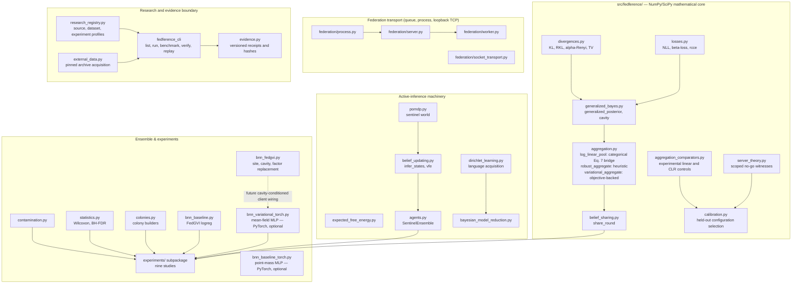

# Active Fedference — Robust Federated Active Inference

[](https://doi.org/10.5281/zenodo.21864004)
[](https://github.com/ActiveInferenceInstitute/Active_Fedference)

Active Fedference is a research project that reimplements **FedGVI** (Federated
Generalized Variational Inference; Mildner, Hamelijnck, Giampouras & Damoulas,
2025, PMLR 267; arXiv:2502.00846) in the discrete-categorical setting and connects it to
the federated **belief-sharing** scenario of Friston et al.
(2024), *Federated inference and belief sharing* (Neurosci. Biobehav. Rev.
156:105500).

## Published release

The v0.1.0 research release is published and cross-referenced across both
surfaces:

- **Permanent DOI:** [`10.5281/zenodo.21864004`](https://doi.org/10.5281/zenodo.21864004)
  · [Zenodo record](https://zenodo.org/records/21864004)
- **Public source and reviewer snapshot:**
  [`ActiveInferenceInstitute/Active_Fedference`](https://github.com/ActiveInferenceInstitute/Active_Fedference)
- **Top-level manuscript PDF:**
  [`Active_Fedference_Research_Manuscript_Zenodo_10.5281-zenodo.21864004.pdf`](Active_Fedference_Research_Manuscript_Zenodo_10.5281-zenodo.21864004.pdf)

The deposited PDF embeds the DOI and public repository URL, and the Zenodo
record lists the public repository as its related identifier. This checkout is
the standalone development/review source; its configured `origin` is the
interim [`docxology/active_fedference`](https://github.com/docxology/active_fedference)
remote.

The headline result is a **project-local** identity. On the same categorical
inputs, the zero-robustness server path is bit-identical to the project's
log-linear pool. In code:

```python
from fedference.aggregation import robust_aggregate, log_linear_pool

# Exact project identity: zero-robustness robust pooling == log-linear pooling.
assert (robust_aggregate(local_posteriors, robustness=0.0).consensus
        == log_linear_pool(local_posteriors)).all()
```

The comparison with Friston et al. (2024) Eq. 7 is a **categorical
posterior-log-potential specialization**, not a reconstruction of its complete
message-passing protocol. It assumes a shared categorical support,
`q_n = softmax(m_n)` for the admitted local message potential `m_n`, and a
fixed project weight mapping. Then `softmax(sum_n w_n log q_n)` equals
`softmax(sum_n w_n m_n)` because the local normalizers are state-independent.
It does not reproduce the source factor graph, cavity/message schedule, or all
source protocol choices.

Robustness is therefore a tested recovery-limit extension of the *project's*
categorical pool, not a competitor to or full reconstruction of Friston's
protocol. The source-conditional robust client loss has its own
bounded-influence result; the objective-backed variational server rule instead
bounds its raw effective-weight update and shows redescending behavior only on
declared paths. The client KLD/NLL/beta=0 limit and the server
zero-robustness identity are separate recovery statements. The sharper
server-side `robust_aggregate` rule is reported separately as a heuristic whose
proven property is the project-local recovery limit.

## The problem this solves

The project log-linear pool is a product-of-experts: every agent holds a
multiplicative veto. Under the categorical bridge assumptions, it gives a
scoped view of the belief-sharing mechanism related to Friston. In the fixed
categorical world and attack geometry studied here, a miscalibrated or
adversarial sentinel can drag the colony off the truth; the source mechanism
itself is not a contamination experiment. FedGVI provides robust
federated-learning machinery, and Active Fedference evaluates this scoped
categorical bridge rather than claiming a universal literature gap.

## Architecture

Thin orchestrators, all math in `src/fedference/`, and named boundary adapters
for evidence, data, checkpoints, and transport.



The architecture diagram is source documentation, not an import-graph claim:
the executable layer gate remains `src/fedference/`-only and the report-schema
validator remains the single JSON write boundary. All README/docs Mermaid
blocks use GitHub-compatible fenced syntax. Check them without a browser with:

```bash
uv run --locked python scripts/validate_mermaid.py
uv run --locked python scripts/validate_mermaid.py --render --renderer npx \
  --output-dir .tmp/mermaid-render
```

The second command invokes Mermaid CLI and writes only review scratch files;
the `.mmd` sources remain in Markdown so GitHub renders the same diagrams.

- **`src/fedference/` core** — `divergences`, `losses`, `generalized_bayes`,
  `aggregation`, `belief_sharing`, and the implementation-derived `complexity`
  catalog. The recovery limits live here and are pinned
  by tests (the $\beta\to0$, $\alpha\to1$, robustness$\to0$ corners).
- **Active-inference machinery** — `pomdp` (sentinel world), `belief_updating`
  (variational state inference + free energy), `dirichlet_learning` (language
  acquisition), `expected_free_energy`, `bayesian_model_reduction`.
- **Ensemble** — `agents.SentinelEnsemble` (shared vs private factors),
  `colonies` (seeded colony builders), `contamination` (confident-wrong /
  label-noise saboteurs).
- **Experiments** — the `experiments/` subpackage wires the locked primitives into nine
  JSON-serializable core studies (three categorical source-mechanism analogues plus the
  robustness sweep, moving-world and hierarchical extensions, sensitivity,
  parameter recovery, and a hierarchical structure-learning study) plus extension studies (contamination gallery, robustness
  onset, descent comparison, etc.); `statistics.py` supplies the paired Wilcoxon
  test and BH-FDR that earn the "robust beats naive" verdict; `bnn_baseline.py`
  anchors the result at the classification level, and the optional
  `bnn_baseline_torch.py` and `bnn_variational_torch.py` modules provide
  composable point-mass and mean-field MLP complements when torch is installed.
- **Complexity diagnostic** — `run_complexity_scaling` calculates the dense
  implementation orders, measures seeded aggregation/sharing/inference scaling
  on the configured machine, and records timing variability without promoting
  machine-specific slopes to general performance claims.
- **Research/evidence boundary** — `research_registry` declares source bundles,
  datasets, profiles, estimands, falsifiers, and no-claim outcomes;
  `external_data` owns hash-checked caller-cached acquisition; `evidence`
  writes versioned content-bound receipts; and the installed CLI exposes those
  contracts without writing into the committed reviewer snapshot.
- **Federation transport** — ``federation/`` subpackage is a real queue-based
  single-machine multiprocess transport (multiprocessing queues + worker OS
  processes: `process.py`, `server.py`, `worker.py`, `transport.py`), verified
  bit-identical to in-process aggregation end-to-end. The same protocol also
  has a tested loopback-TCP adapter with versioned round/worker/configuration
  envelopes, optional HMAC framing, and persisted digest-verified replay
  (`socket_transport.py`). A caller-shared `ReplayGuard` rejects round-id reuse
  within one process, while `PersistentReplayGuard` makes that claim durable
  across local process restarts using caller-owned SQLite state. Docker/mTLS
  emulation, multi-host replay-domain design, and physical cross-host
  deployment remain open, separate lanes; see the
  [threat model](docs/security/active_fedference-threat-model.md).

The central **project-local** identity is
`robust_aggregate(robustness=0) == log_linear_pool`; with its default
`entropy_weight=1`, `variational_aggregate` has the same zero-robustness
recovery. Under the documented categorical posterior-log-potential assumptions,
the pool specializes the source Eq. 7; it is not a reconstruction of the full
source protocol. Separately, `generalized_posterior(KLD, NLL)` equals
closed-form prior×likelihood Bayes.

The stable rich-result entry point is `aggregate_result`. A single validated
configuration travels unchanged through direct sharing, queue/process
federation, and loopback sockets:

```python
from fedference import AggregationConfig, aggregate_result

config = AggregationConfig(
    method="variational",
    robustness=1.5,
    entropy_weight=0.8,
    max_iter=64,
    tol=1e-9,
)
result = aggregate_result(local_posteriors, config=config)
print(
    result.consensus,
    result.converged,
    result.fallback_events,
    config.fingerprint,
)
```

The existing top-level aggregation functions and `aggregate(...)` retain their
array-returning compatibility behavior. Passing both a configuration and legacy
tuning arguments fails explicitly instead of silently choosing one. A nominal
rich result has an empty `fallback_events` tuple; any numerical base-weight
substitution is explicit, and a trajectory returned from that substituted state
is not promoted to solver convergence. A multi-start operation can still report
a fallback from a discarded start while returning a separately converged,
fallback-free start.

### Composable integration surfaces

The package is deliberately assembled from small, typed boundaries:

- `fedference.aggregation` provides pure categorical pooling and the rich
  `aggregate_result(..., config=AggregationConfig(...))` contract.
- `fedference.belief_sharing` reuses the same aggregation protocol for direct
  rounds; `fedference.federation.process` and
  `fedference.federation.socket_transport` provide one-machine process and
  loopback transport adapters without duplicating the math.
- `fedference.evidence`, `external_data`, checkpoint helpers, and replay
  guards own explicit caller-authorized I/O and produce verifiable receipts.
- `fedference_cli` is a thin registry/run/benchmark/verify/replay boundary;
  optional Torch/BNN modules are imported only when the corresponding extra is
  selected.
- `src/figures` consumes validated reports, while `_metadata.py`, manuscript
  captions, and `output/figures/figure_registry.json` keep visual meaning and
  provenance synchronized.

Public legacy names remain available. New code should compose the typed
configuration/result path and treat transport, evidence, rendering, and
publication as adapters around the same core operation.

## How to run

From the project root:

```bash
# Install the pure NumPy/SciPy core with the committed lockfile.
uv sync --locked

# Add the reproducibility, test, lint, type-check, and CPU/Torch tooling.
uv sync --locked --extra dev

# Optional mean-field BNN and CPU/MPS support
uv sync --locked --extra bnn

# Run the full project test suite with the 90% coverage gate on src/
uv run --locked --extra dev pytest tests/ \
  --cov=src --cov-fail-under=90

# Spot-check four of the nine tracked studies (deterministic under the config seed)
uv run --locked python -c "
from fedference import experiments as e
seed = 20240601
print('belief sharing :', e.run_belief_sharing(seed))
print('language       :', e.run_language_acquisition(seed)['final_kl'])
print('emergence      :', e.run_emergence(seed)['convergence'])
print('robustness     :', e.run_robustness_sweep(seed)['any_robust_wins'])
"

# Inspect the source-bound complexity catalog and measured scaling report after analysis
uv run --locked python -c '
import json
from pathlib import Path
r = json.loads(Path("output/reports/complexity_scaling.json").read_text())
print([(row["method"], row["axis"], row["observed_log_log_slope"]) for row in r["measurements"]])
'
```

Experiment parameters (seed, per-study knobs, the robustness-sweep grid,
divergence labels, statistical $\alpha$) all live in
[`manuscript/config.yaml`](manuscript/config.yaml) → `experiment:`, mirroring the
keyword arguments of the `fedference.experiments` study functions exactly.

## Installed CLI and evidence contracts

The package installs `fedference` with five commands:

```bash
# Inspect source-bound experiments, profiles, datasets, and source revisions
uv run --locked fedference list --json

# Correctness-only registered run; output must be explicit and outside output/
uv run --locked fedference run server-theory \
  --profile smoke --seed 0 --output-dir .tmp/server-theory-smoke

# Hash-checked UCI benchmark smoke
uv run --locked fedference benchmark \
  --dataset-id uci-banknote --profile smoke --seed 42 \
  --cache-dir .tmp/uci-cache --output-dir .tmp/banknote-smoke

# Verify config/report bytes, configuration hash, and completion status
uv run --locked fedference verify .tmp/banknote-smoke/receipt.json

# Publication mode also matches the live commit, tree, and uv.lock.
# It passes only when the receipt was created from this same clean checkout.
uv run --locked fedference verify .tmp/banknote-smoke/receipt.json --require-clean-git
```

`ExperimentSpec`, `DatasetSpec`, and `RunReceipt` are versioned public
contracts. The registry records source bundles, primary estimands, independent
units, falsifiers, no-claim outcomes, smallest effects, MCSE targets, budgets,
comparison families, and execution profiles. A schema-1.1 receipt records the
full Git commit plus clean/dirty/unavailable tree state, environment lock,
configuration and dataset hashes, seeds, backend/device, fallbacks,
checkpoints, outputs, and status. `config.json` is itself receipt-bound so the
configuration hash can be recomputed. Registry entries declare intended
evidence; they do not imply that an open experiment has succeeded.
Tabular benchmark rows additionally record per-method fallback and
non-convergence counts at held-out-prediction grain plus the maximum iteration
count. The receipt summarizes affected dataset/seed/method cells; those counts
are diagnostics, not independent scientific units.

Strict verification resolves the current checkout by default and compares its
full commit, clean tree state, and `uv.lock` digest with the receipt. When
verifying from elsewhere, pass `--project-root /path/to/checkout` explicitly.

Write-producing commands require `--output-dir`, reject non-empty targets, and
refuse the committed `output/` reviewer snapshot. Smoke and pilot results are
never manuscript evidence.

## Manuscript

The manuscript under [`manuscript/`](manuscript/) reports all nine studies. Every
number in the prose is a `{{TOKEN}}` hydrated from analysis outputs — never typed
by hand (ISC-30/35/36). The "robust beats naive" verdict in particular is emitted
by the statistics module after a paired Wilcoxon test deflated with
Benjamini–Hochberg FDR, then injected into the robustness results sections
(e.g. [`19_results_robustness.md`](manuscript/19_results_robustness.md)).

## Cover image

The manuscript cover is configured in `manuscript/config.yaml` and stored at
`manuscript/cover_image.png` (regenerated by `src/figures/graphical_abstract.py`).

## Reproducing outputs

Generated outputs under `output/` are committed as deterministic reviewer
snapshots, not hand-maintained source. After any manuscript, experiment, or
figure-producing change, regenerate the reports, variables, PDF, web package,
and release manifest with the documented scripts before committing the refreshed
artifacts. Analysis report payloads are validated against typed schemas at the
write boundary (`src/analysis/report_schemas.py` — `TypedDict` shapes plus
per-figure dependency contracts), so a malformed or renamed field fails when it
is written, not when a figure later consumes it. The release bundle carries a
provenance fingerprint (a SHA-256 over the declared source, manuscript,
documentation, producer-script, dependency-lock, and claim-audit inputs).
The manifest also records the pipeline profile and generator version;
`uv run --locked python scripts/build_release.py --verify` recomputes the fingerprint
and names changed inputs when a bundle is stale. The guarded CLI also requires
fresh publication-profile analysis, validation, hydration, and render receipts;
it establishes a local reviewer bundle, not clean-clone reproduction or
external release authorization. Unreleased builds omit
`generated_at` so rebuilding the same evidence tree is byte-identical. An
approved release may add canonical UTC metadata with `--timestamp` or
`SOURCE_DATE_EPOCH`. Pipeline-stage receipts follow the same rule: their
content hashes are reproducible by default, and time metadata is explicit.
Wheel and source-distribution builds use an exactly pinned setuptools backend
and a small PEP 517 wrapper that normalizes archive metadata whenever
`SOURCE_DATE_EPOCH` is supplied. The release ladder builds both formats twice
and rejects backend-version, member-order, owner, or checkout-mtime drift.

Local PDF page renders and other review scratch files belong under `.tmp/` and
are ignored. They are useful for visual QA but are not publication evidence or
release inputs.

The validated HTML manuscript is the canonical accessibility-enhanced reader
surface. The current combined and slide PDFs are structurally/textually/
visually checked but untagged and are not claimed PDF/UA-conformant. The exact
automated and manual boundary is in
[`docs/manuscript/accessibility.md`](docs/manuscript/accessibility.md).

## Evidence status and active research

Every load-bearing claim is graded on four evidence levels: **formal/executable
identities** (an algebraic statement with a corresponding invariant or
negative-control test), **source-conditional results** (inherited from a cited
source only under that source's assumptions), **conditional empirical findings**
(true of the declared seeded simulation and its estimand, not generalized beyond
it), and **scoped implementation facts** (true of the executed code path, not a
universal property of the method family). The three robustness axes keep their
distinct guarantees: the client-side FedGVI update ($\beta$-loss / rcce) carries
the cited bounded-influence result under the source theorem's matching
assumptions; `robust_aggregate` is a sharp server heuristic whose positive
formal property is the exact zero-robustness recovery limit, with a scoped
no-go proposition excluding a declared separable objective class but not every
broader construction; and
`variational_aggregate` carries an objective-backed raw effective-weight bound,
not estimator-level B-robustness. The MAJ-1 characterization report covers
influence, finite-breakdown, attack-mechanism, state-space, agent-count,
robustness, and weight-imbalance diagnostics, with explicit negative controls and
no-claim metadata. See [`docs/research/manuscript-claim-audit.md`](docs/research/manuscript-claim-audit.md)
and [`docs/todo/scholarship-and-phase-plan.md`](docs/todo/scholarship-and-phase-plan.md).

## Conventions

- Pure NumPy/SciPy core (the optional `bnn` extra adds the PyTorch point-mass,
  mean-field, and CPU/MPS runtime modules without changing default
  dependencies); typed;
  `from __future__ import annotations`; deterministic
  via `np.random.default_rng(seed)` (never global `np.random`).
- No `infrastructure.*` imports inside `src/fedference/` (layer contract).
- No mocks anywhere — tests are real seeded computations with explicit numeric
  expectations; the no-mocks policy is part of this repository's acceptance
  contract.
- $\ge 90\%$ line coverage on `src/`; branch measurement is enabled in the
  coverage configuration, while the release-facing achieved line-coverage
  record is `output/data/test_coverage_receipt.json`. `coverage_project.json`
  is only an ignored local convenience export and never reviewer evidence.
- New modules: `src/fedference/<name>.py` with a sibling
  `tests/fedference/test_<name>.py`; module docstring cites the relevant Friston (2024)
  equation/figure or FedGVI mechanism.

## Documentation

| Entry | Purpose |
| --- | --- |
| [`docs/README.md`](docs/README.md) | Modular documentation hub (architecture, testing, pipeline, ops) |
| [`AGENTS.md`](AGENTS.md) | Slim technical reference and validation commands |
| [`ISA.md`](ISA.md) | Live acceptance-criteria contract |
| [`STANDALONE.md`](STANDALONE.md) | Confidentiality and standalone/fork notes |
| [`docs/reference/api-stability.md`](docs/reference/api-stability.md) | Public API/schema compatibility and deprecation policy |
| [`docs/security/active_fedference-threat-model.md`](docs/security/active_fedference-threat-model.md) | Federation trust boundaries, abuse paths, and security no-claim rules |
| [`docs/manuscript/accessibility.md`](docs/manuscript/accessibility.md) | HTML accessibility contract and tagged-PDF boundary |

Start with [`docs/development/quickstart.md`](docs/development/quickstart.md) for a first green run.
