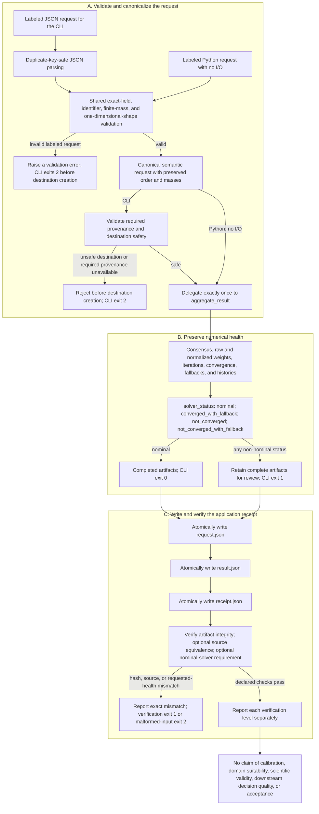

# Application guide

Use this guide to combine caller-owned categorical posteriors while retaining
their state labels, agent identities, numerical health, and provenance. The
primary application boundary is the labeled request: call `aggregate_labeled`
from Python, or give the same JSON to `fedference aggregate` to obtain an
application receipt. The smaller `AggregationConfig + aggregate_result` path
remains the mathematical API when your program already owns all labels and
evidence handling.

An application result is an aggregation, not a decision. The library never
invents a winning label, threshold, abstention rule, acceptance Boolean, or
scientific interpretation. Likewise, an application receipt proves declared
input/output/provenance integrity. It does **not** prove that the input models
are calibrated, that an aggregation rule is suitable for the domain, that a
downstream decision is safe, or that a scientific claim is valid.

## Application, solver-health, and receipt flow



**Text equivalent.**

| Stage | Successful path | Distinct failure or review path | What the stage does not establish |
| --- | --- | --- | --- |
| Request boundary | CLI JSON first passes duplicate-key parsing; CLI and pure Python requests then share exact-field, identifier, finite-mass, and one-dimensional-shape validation. The canonical semantic request preserves order and caller-supplied masses. Before delegation, the CLI separately validates required provenance and destination safety; the pure Python route performs no I/O. | An invalid labeled request follows its own exit; an unsafe destination or unavailable required provenance follows a distinct CLI exit. Both CLI cases exit 2 before the destination is created, while the pure Python boundary raises a validation error. | Valid input shape or path safety does not establish calibration or domain suitability. |
| Aggregation boundary | The labeled adapter delegates once to `aggregate_result` and retains consensus, raw and normalized weights, iterations, convergence, fallbacks, and histories. | The three non-nominal statuses retain complete artifacts and make the CLI exit 1 rather than discarding evidence. | A nominal solver status does not establish scientific validity or decision quality. |
| Write boundary | `request.json`, `result.json`, and `receipt.json` are written atomically in that order. | Partial unsafe setup is rejected before creation; a completed receipt records execution completion, not acceptance. | File production does not authorize a downstream action. |
| Verification boundary | Artifact integrity is always checked; source equivalence and nominal solver health are reported only when requested and available. | Hash, source, or requested-health mismatches produce explicit findings and a nonzero exit. | Receipt integrity, source equivalence, and nominal numerical health do not establish calibration, domain suitability, scientific validity, a downstream decision, or acceptance. |

## Fastest own-data path

The default runtime supports Python 3.10 or newer and does not import Torch.
From the source checkout:

```bash
uv sync --locked
FEDFERENCE_APP_ROOT="$(mktemp -d /tmp/active-fedference-app.XXXXXX)"
uv run --locked fedference aggregate \
  --input examples/data/labeled_aggregation_request.json \
  --output-dir "$FEDFERENCE_APP_ROOT/run" \
  --project-root .
uv run --locked fedference verify \
  "$FEDFERENCE_APP_ROOT/run/receipt.json" \
  --require-nominal-solver
```

Expected files are `request.json`, `result.json`, and `receipt.json`. A nominal
run exits 0 and prints one sorted JSON object containing their absolute paths
and `"solver_status": "nominal"`. Any non-nominal numerical result is retained
but exits 1. Schema, usage, provenance, and unsafe-path failures exit 2 without
creating the destination.

```json
{"receipt": "/absolute/run/receipt.json", "request": "/absolute/run/request.json", "result": "/absolute/run/result.json", "solver_status": "nominal"}
```

Run the complete labeled example, which checks Python/CLI bit identity and the
receipt verifier:

```bash
FEDFERENCE_EXAMPLE_ROOT="$(mktemp -d /tmp/active-fedference-example.XXXXXX)"
uv run --locked python examples/05_labeled_application.py \
  --output-dir "$FEDFERENCE_EXAMPLE_ROOT/run" \
  --project-root .
```

## The labeled request

Each agent supplies one finite, non-negative categorical mass vector over the
same ordered labels. Rows need not sum to one: the canonical request preserves
the supplied masses, while `normalized_local_posteriors` in the result exposes
the normalized rows separately. Base weights are non-negative log-pooling
coefficients; at least one must be positive. An omitted `base_weight` becomes
`1.0` in the canonical semantic request.

The accepted JSON envelope is exactly:

```json
{
  "schema_version": "1.0",
  "state_labels": ["clear", "warning", "critical"],
  "agents": [
    {
      "agent_id": "agent-0",
      "posterior": [0.7, 0.2, 0.1],
      "base_weight": 1.0
    }
  ],
  "aggregation_config": {
    "method": "robust",
    "robustness": 1.5,
    "entropy_weight": 1.0,
    "max_iter": 64,
    "tol": 1e-9,
    "multistart": true
  }
}
```

Validation fails closed on duplicate JSON keys, unknown fields, non-standard
`NaN`/infinity constants, Booleans used as numbers, duplicate or whitespace-
padded labels and agent IDs, ragged or multidimensional vectors, label/posterior
length mismatches, negative masses, all-zero rows, and all-zero base weights.
Identifier text and list order are preserved exactly; identifiers are neither
trimmed nor Unicode-normalized. The request hash is computed from the canonical
semantic object, not whitespace or pretty-printing, so equivalent formatting
and an omitted default weight have the same semantic digest.

### Strict-shape migration

Version 1.1 intentionally rejects a row matrix such as `[[0.7, 0.3]]`, a column
matrix such as `[[0.7], [0.3]]`, or a higher-rank tensor when a single PMF or
weight vector is expected. Earlier implicit flattening could silently change
the modeled state dimension and contradicted the one-vector-per-agent contract.

Pass each categorical vector as a Python list or one-dimensional NumPy array:

```python
import numpy as np

valid_posterior = np.asarray([0.7, 0.2, 0.1], dtype=np.float64)
valid_base_weights = np.asarray([1.0, 0.75], dtype=np.float64)
```

At the numeric matrix boundary, an outer generator yielding one-dimensional
row vectors remains supported. Labeled request JSON uses lists, and the typed
labeled constructor accepts a list or tuple of agents. If existing code has a
known singleton dimension, remove it explicitly at the caller boundary and
assert the resulting shape; the library will not guess whether a dimension was
accidental.

## Labeled Python API

Construct the typed envelope and delegate once to the canonical aggregator:

```python
from fedference import (
    AgentPosterior,
    AggregationConfig,
    LabeledAggregationRequest,
    aggregate_labeled,
)

request = LabeledAggregationRequest(
    state_labels=("clear", "warning", "critical"),
    agents=(
        AgentPosterior("agent-0", [7.0, 2.0, 1.0]),
        AgentPosterior("agent-1", [0.6, 0.3, 0.1]),
        AgentPosterior("agent-2", [0.1, 0.1, 0.8], base_weight=0.75),
    ),
    config=AggregationConfig(
        method="robust",
        robustness=1.5,
        entropy_weight=1.0,
        max_iter=64,
        tol=1e-9,
        multistart=True,
    ),
)
result = aggregate_labeled(request)

print(result.state_labels)
print(result.aggregation.consensus)
print(result.aggregation.solver_status)
print(result.request_sha256)
```

`LabeledAggregationRequest.from_dict()` and `.from_json()` are strict readers;
`.as_dict()` emits the canonical request and expands default weights.
`LabeledAggregationResult.from_dict()` and `.as_dict()` round-trip the exact
result schema. The result JSON contains only:

- schema and operation identifiers;
- software version and canonical request digest;
- ordered state labels and agent IDs;
- normalized local posterior rows;
- complete aggregation configuration and fingerprint; and
- complete aggregation diagnostics.

It deliberately contains no inferred class, decision, threshold, abstention,
scientific claim, or acceptance Boolean. The direct Python call performs no
I/O and writes no receipt.

## Receipt-writing CLI

The CLI takes configuration only from the request JSON:

```text
fedference aggregate \
  --input REQUEST_JSON \
  --output-dir NEW_EMPTY_DIRECTORY \
  [--project-root CHECKOUT] \
  [--require-clean-git]
```

It validates the request, optional provenance requirement, and destination
before creating the destination. The destination must be new or empty and may
not be inside the committed `output/` reviewer tree. Files are written
atomically in producer order: canonical `request.json`, `result.json`, then
`receipt.json`. The receipt binds exactly the request and result as artifact
records, plus UTC start/end times, runtime/source provenance, request and
configuration hashes, and solver status/fallbacks.

`status="completed"` means execution reached artifact completion. It does not
mean the solver was nominal, the input was scientifically valid, or a
downstream action is warranted.

### Verification levels

Artifact-only verification works after moving the three files together:

```bash
fedference verify /path/to/run/receipt.json
```

The human output distinguishes:

- application artifact integrity verified;
- source equivalence verified when a checkout was explicitly supplied; or
- source equivalence not requested/unavailable.

Request live source equivalence when you have the originating checkout:

```bash
fedference verify /path/to/run/receipt.json \
  --project-root /path/to/checkout
```

Add `--require-clean-git` when both recorded and live evidence must bind a clean
tree. Add `--require-nominal-solver` to reject an otherwise integrity-valid
application receipt whose solver status is non-nominal. That option is invalid
for research receipts and exits 2.

The verifier can establish byte integrity and, when requested and available,
source equivalence. It cannot validate input calibration, domain suitability,
causal interpretation, scientific replication, or a downstream decision.

## Solver health and troubleshooting

Every rich aggregation result carries one of four statuses:

| Converged | Fallbacks | `solver_status` |
| --- | --- | --- |
| Yes | None | `nominal` |
| Yes | Present | `converged_with_fallback` |
| No | None | `not_converged` |
| No | Present | `not_converged_with_fallback` |

Retain and inspect `iterations`, `converged`, `fallback_events`, `history`, and
`free_energy_history`; never collapse them to a consensus-only success flag.

Common responses:

| Symptom | Check | Safe next action |
| --- | --- | --- |
| `not_converged` | Iteration budget, tolerance, repeated/near-zero rows | Retain the artifacts, review the trajectory, and rerun only under a new recorded configuration |
| `*_with_fallback` | Exact fallback codes and affected starts | Treat it as a review condition; do not describe it as nominal |
| Request exits 2 | Duplicate/unknown keys, dimensions, non-finite values, label length | Fix the caller-owned request; the failed destination should not exist |
| Destination rejected | Non-empty path or path below committed `output/` | Choose a fresh caller-owned path; never delete retained evidence implicitly |
| Clean Git required | Dirty/unavailable checkout provenance | Use a reviewed clean checkout or omit the stronger requirement and report that boundary honestly |
| Receipt tamper finding | Request/result bytes or recorded hash changed | Recover the original artifact set; do not edit a retained receipt in place |

Changing `max_iter`, `tol`, robustness, entropy weight, or method changes the
configuration fingerprint and constitutes a new application run. A less strict
tolerance is not a repair to an existing receipt.

## Choose an aggregation rule

The method is a modeling choice, not a quality ranking:

| `method` | Declared role | Important boundary |
| --- | --- | --- |
| `naive` | Deterministic project log-linear pool baseline | A product-of-experts permits a confident agent to exert a multiplicative veto |
| `robust` | Reverse-KL-reweighted project server heuristic | Its established formal property is recovery of the project pool at `robustness=0`, not a universal robustness theorem |
| `variational` | Conservative objective-backed server rule | Its raw-weight bound and descent diagnostics are not estimator-level bounded influence of the normalized consensus |

Set every material control explicitly and retain the configuration fingerprint.
`entropy_weight` and `multistart` materially affect the variational rule. The
comparison between the naive pool and Friston et al. Eq. 7 is a categorical
posterior-log-potential specialization under documented shared-support,
admitted-potential, and fixed-weight assumptions; it is not a reconstruction of
the full factor graph or message-passing protocol.

## Smallest mathematical API

Use the numeric boundary when your program already owns identifiers,
serialization, and provenance. This remains the smallest mathematical path:

```python
from fedference import AggregationConfig, aggregate_result

local_posteriors = [
    [0.70, 0.20, 0.10],
    [0.60, 0.30, 0.10],
    [0.10, 0.10, 0.80],
]
config = AggregationConfig(
    method="robust",
    robustness=1.5,
    entropy_weight=1.0,
    max_iter=64,
    tol=1e-9,
    multistart=True,
)
result = aggregate_result(local_posteriors, config=config)
print(result.consensus, result.solver_status)
```

Each mass row is validated, floored at `1e-12`, and then normalized at the API
boundary. The floor applies to small positive masses as well as exact zeros.
Consequently, rescaling a row can change the admitted probabilities when some
raw masses cross that floor. The pooling formulas use these admitted rows; the
labeled result exposes them as `normalized_local_posteriors`, while the request
retains the original masses.

`raw_effective_weights` are the actual final
coefficients; `normalized_effective_weights` are relative-influence diagnostics
and are not substituted back into the pool. Scaling all raw base weights may
change consensus concentration.

`AggregationResult.as_dict()` emits finite JSON-compatible consensus, raw and
normalized weights, iteration count, convergence, fallback events, iterate and
free-energy histories, and solver status. Legacy top-level functions and
`aggregate(...)` keep their existing return types.

## Choose the narrowest interface

| Need | Canonical boundary | Compatibility surface / limit |
| --- | --- | --- |
| Own-data JSON with labels and evidence | `fedference aggregate` | Writes application request, result, and receipt |
| Own-data Python with labels | `aggregate_labeled` | Pure typed operation; caller retains evidence |
| Smallest numeric operation | `aggregate_result` | Labels and evidence remain caller-owned |
| Recipient-specific in-process sharing | `share_round_result` | `share_round` retains legacy `SharingDiagnostics` |
| Spawned local workers | `run_multiprocess_round_result` | Consensus-returning process helpers remain |
| Loopback transport and replay | `run_socket_round_result` | Protocol v1 and legacy socket dictionary remain unchanged |
| Inspect a socket transcript | `inspect_socket_replay` | `validate_socket_replay` remains integrity-only Boolean |
| Registered research workflow | `fedference run` / `benchmark` | Research receipts are not application receipts |
| Optional synthetic BNN lane | install the `bnn` extra | Torch stays outside the default import graph |

Sharing, process, and socket rich results propagate the same server
`AggregationResult` rather than duplicating aggregation mathematics. Process
and socket convenience helpers use uniform base weights in v1.1. Socket
transport remains loopback-only; protocol version 1, frame envelope, and the
on-wire `consensus`/`agent_weights` payload are unchanged. These boundaries do
not establish physical multi-host, privacy, mTLS, or Byzantine-robust operation.

When calling spawned workers from your own program, use a real importable file
and an `if __name__ == "__main__":` guard. Do not launch them from an unguarded
module body or `python -c`.

## Replay findings

`inspect_socket_replay` separates integrity validity from numerical health. A
deterministically recomputed but non-converged round can be integrity-valid and
still carry a solver finding. By default the replay reader uses the recorded
configuration; any explicitly supplied method/tuning value is an assertion
that must match it.

For automation:

```bash
fedference replay \
  --replay /path/to/replay.json \
  --beliefs /path/to/beliefs.json \
  --consensus /path/to/consensus.json \
  --json \
  --require-nominal-solver
```

Exit 0 means integrity-valid and, when requested, nominal solver health. Exit 1
means an integrity finding or requested nominal-health failure. Exit 2 means
malformed command/input. Human failure output uses stable finding codes and
messages rather than a bare `FAIL`. The compatibility
`validate_socket_replay()` remains an integrity-only Boolean.

## Install a wheel or source distribution

No PyPI publication is claimed for v1.1. Use a verified GitHub-release artifact
when it exists, or build from the exact reviewed checkout. A wheel contains the
typed runtime, `fedference` CLI, and `fedference/py.typed`; the source
distribution additionally contains this guide, all numbered examples, and the
example JSON data.

```bash
export SOURCE_DATE_EPOCH="$(git log -1 --format=%ct)"
FEDFERENCE_PACKAGE_ROOT="$(mktemp -d /tmp/active-fedference-package.XXXXXX)"
uv build --out-dir "$FEDFERENCE_PACKAGE_ROOT/dist"
uv venv "$FEDFERENCE_PACKAGE_ROOT/env"
uv pip install --python "$FEDFERENCE_PACKAGE_ROOT/env/bin/python" \
  "$FEDFERENCE_PACKAGE_ROOT"/dist/*.whl
cd "$FEDFERENCE_PACKAGE_ROOT"
"$FEDFERENCE_PACKAGE_ROOT/env/bin/python" -c \
  "import sys, fedference; assert 'torch' not in sys.modules; print(fedference.__version__)"
"$FEDFERENCE_PACKAGE_ROOT/env/bin/fedference" aggregate \
  --input /path/to/labeled_aggregation_request.json \
  --output-dir "$FEDFERENCE_PACKAGE_ROOT/installed-run"
"$FEDFERENCE_PACKAGE_ROOT/env/bin/fedference" verify \
  "$FEDFERENCE_PACKAGE_ROOT/installed-run/receipt.json" \
  --require-nominal-solver

# Independently install and exercise the source distribution.
uv venv "$FEDFERENCE_PACKAGE_ROOT/sdist-env"
uv pip install --python "$FEDFERENCE_PACKAGE_ROOT/sdist-env/bin/python" \
  "$FEDFERENCE_PACKAGE_ROOT"/dist/*.tar.gz
"$FEDFERENCE_PACKAGE_ROOT/sdist-env/bin/python" -c \
  "import sys, fedference; assert 'torch' not in sys.modules; print(fedference.__version__)"
"$FEDFERENCE_PACKAGE_ROOT/sdist-env/bin/fedference" aggregate \
  --input /path/to/labeled_aggregation_request.json \
  --output-dir "$FEDFERENCE_PACKAGE_ROOT/sdist-installed-run"
"$FEDFERENCE_PACKAGE_ROOT/sdist-env/bin/fedference" verify \
  "$FEDFERENCE_PACKAGE_ROOT/sdist-installed-run/receipt.json" \
  --require-nominal-solver
```

Running from outside the checkout proves the installed artifact supplies the
runtime rather than accidentally importing source files. It still does not
prove the scientific suitability of the request or aggregation rule.

## Application checklist

Before trusting an application result, confirm all of the following:

- every posterior has the same declared state order and compatible semantics;
- inputs are calibrated categorical masses, not logits, class IDs, samples, or
  unreviewed scores;
- every individual posterior and weight vector is genuinely one-dimensional;
- the method and all controls were selected deliberately and retained;
- solver status, fallbacks, iterations, and trajectories were reviewed;
- application thresholds, abstention, costs, and actions are defined outside
  this package;
- artifact integrity and source equivalence are reported as separate levels;
- a receipt is not described as scientific validity or decision approval; and
- local process/socket checks are not promoted to physical deployment evidence.

## Where to go next

- Run all five examples: [`../examples/README.md`](../examples/README.md)
- Resolve operational failures:
  [`operations/troubleshooting.md`](operations/troubleshooting.md)
- Review recurring questions: [`operations/faq.md`](operations/faq.md)
- Understand the method and claim boundaries:
  [`core/conceptual-foundations.md`](core/conceptual-foundations.md)
- Check compatibility and schema evolution:
  [`reference/api-stability.md`](reference/api-stability.md)
- Reproduce tests and publication artifacts:
  [`development/quickstart.md`](development/quickstart.md)
