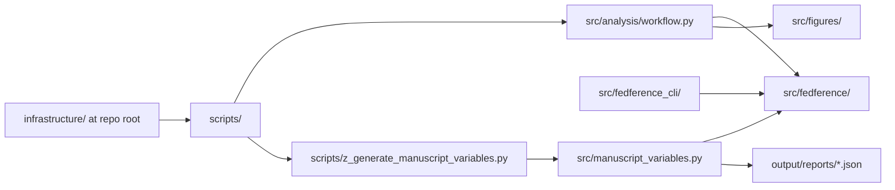
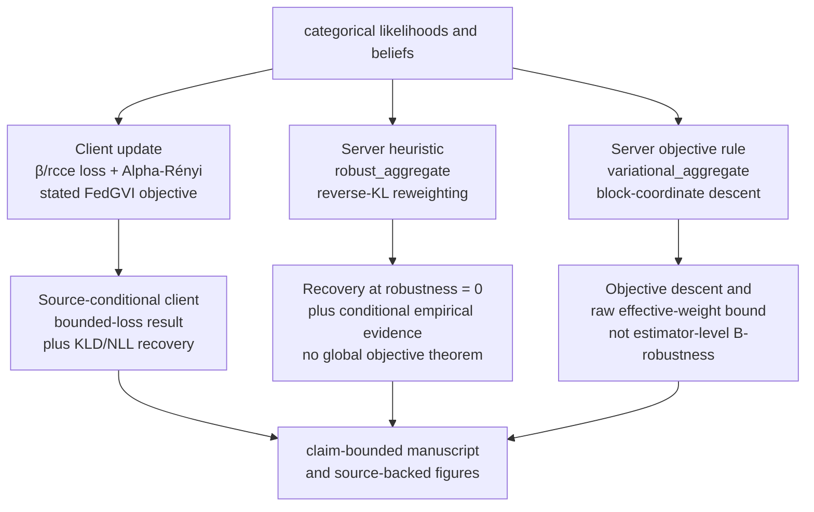

# Architecture

Active Fedference follows the template **thin orchestrator** pattern: all
mathematics lives in `src/fedference/`; orchestration lives in
`src/analysis/`, `src/figures/`, and `scripts/`. A small set of named domain
boundary adapters owns explicit evidence, dataset/cache, checkpoint, packaged
resource, and replay I/O.

## Layer contract

| Layer | Path | Rule |
| --- | --- | --- |
| Domain layer | `src/fedference/` | Mathematical modules use NumPy/SciPy and remain side-effect free; named evidence/data/checkpoint/replay adapters own explicit I/O; optional Torch modules stay behind extras; **no** `infrastructure.*` imports (ISC-21) |
| Installed CLI | `src/fedference_cli/` | Thin registry/run/benchmark/verify/replay adapter; writes only to an explicit caller-owned directory |
| Orchestration | `src/analysis/`, `src/figures/`, `src/manuscript_variables.py` | Wires experiments, serialises JSON (validated at the write boundary by `analysis/report_schemas.py`), generates figures and tokens; still no `infrastructure.*` in this project |
| Scripts | `scripts/*.py` | Thin entry points; subprocess-friendly; call into `src/` |
| Manuscript | `manuscript/` | Markdown + `config.yaml`; numbers are `{{TOKEN}}` only |
| Output | `output/` | Generated reviewer snapshots; regenerated by scripts and committed when refreshed |

Verify the domain boundary:

```bash
! grep -rn "import infrastructure" src/fedference/
```

## Dependency direction



Nothing in `src/fedference/` imports upward to scripts or infrastructure.
Default imports remain Torch-free; boundary effects require an explicit path,
cache, replay target, or checkpoint call.

## Method and evidence boundary

The three robustness surfaces intentionally have different proof obligations.
This diagram is the reviewer's map from implementation to evidence; an arrow
does not transfer a guarantee from one surface to another.



## Module map (`src/fedference/`)

### FedGVI core

| Module | Role | Key recovery limit |
| --- | --- | --- |
| `_validation.py` | Shared finite-simplex, matrix, and non-negative-weight boundary validation | invalid mass is rejected; valid rows normalize once |
| `divergences.py` | KL, reverse-KL, standard Rényi, FedGVI Alpha-Rényi, TV; named dispatch (KLD/RKL/AR/TV) | both Rényi forms recover KL as $\alpha\to1$ |
| `losses.py` | NLL, density-power $\beta$-loss, robust categorical cross-entropy (rcce) | $\beta$-loss $\to$ NLL as $\beta\to0$; rcce $\to$ NLL as $q\to0$ |
| `generalized_bayes.py` | `generalized_posterior`, exact finite-support Alpha-Rényi solve, `cavity`, `update_factor`, `softmax` | `generalized_posterior(KLD,NLL)` = Bayes; AR minimizes its named objective |
| `aggregation.py` | `AggregationConfig`, `AggregatorProtocol`, canonical `aggregate_result`, compatibility `aggregate`, log-linear, heuristic, and variational rules | both robust methods recover the project `log_linear_pool` at zero robustness with the default entropy setting; the Eq. 7 comparison is a documented categorical specialization, not a full protocol reconstruction; configuration hashes bind adapters and receipts |
| `belief_sharing.py` | `share_round` over a colony; sensory-attenuation self-exclusion; shared configuration or mutually exclusive legacy controls | naive round implements the project categorical Eq. 7 bridge, not the full source message-passing protocol |
| `complexity.py` | Implementation-derived asymptotic catalog, concrete dense-work proxies, and seeded benchmark configuration | separates analytic orders from machine-specific timing diagnostics; retained histories are included in memory accounting |

### Active-inference machinery

| Module | Role |
| --- | --- |
| `pomdp.py` | Sentinel world: A/B/C/D for location×proximity×pose×gaze; `build_moving_world` (V4 — disjoint-FOV grid, movement transitions, EFE-guided policy via `efe_policy_select`); `build_hierarchical_world`, `hierarchical_infer` (V2 — 2-level L2 context → L1 location); `LayerSpec`, `build_nlevel_world`, `nlevel_infer`, `build_3level_world` (V2 N-level extension) |
| `belief_updating.py` | `infer_states` (one-step variational), `vfe` |
| `dirichlet_learning.py` | Conjugate Dirichlet likelihood learning ($\eta$ forgetting) |
| `expected_free_energy.py` | EFE decomposition (risk + ambiguity identity) |
| `bayesian_model_reduction.py` | `reduce` — Beta-function $\Delta F$ (Friston Eq. 13) |
| `agents.py` | `SentinelEnsemble` — shared location/proximity/pose, private gaze |

### Federation transport (V3)

Queue-backed federation protocol — each worker serialises its belief over a real
`queue.Queue` channel; the server aggregates and broadcasts. The aggregation math
is unchanged, and the end-to-end result is bit-identical to an in-process call.
The process helper runs the same protocol with single-machine OS worker
processes. The loopback-TCP helper adds real socket framing, a versioned
round/worker/configuration/payload envelope, optional HMAC frame integrity, and
persisted digest-verified replay validation. A caller-shared `ReplayGuard`
rejects round-id reuse during one process lifetime; `PersistentReplayGuard`
uses an atomic caller-owned SQLite store to retain claimed round IDs across
local process restarts. Docker/mTLS emulation, multi-host replay-domain design,
and physical cross-host deployment remain future engineering work rather than
proved claims. See the
[federation threat model](../security/active_fedference-threat-model.md).

| Module | Role |
| --- | --- |
| `federation/transport.py` | Lossless `numpy` float64 serialization with exact one-dimensional probability-vector validation, plus strict protocol-v1 envelopes carrying round, worker, configuration hash, payload digest, and authentication mode |
| `federation/worker.py` | `FederationWorker` — sends belief, receives consensus over `queue.Queue` |
| `federation/server.py` | `FederationServer` — collects beliefs, dispatches through a typed `AggregatorProtocol`, and broadcasts consensus |
| `federation/process.py` | `run_multiprocess_round` — one-machine OS-process round using the same server/worker queues and serialization |
| `federation/socket_transport.py` | `run_socket_round` / `ReplayGuard` / `PersistentReplayGuard` / replay save-load-validate helpers — enforced loopback TCP, HMAC-framed payloads, process-local or restart-durable local round-reuse rejection, strict event schemas/order, and persisted digest-verified replay validation |

### Hierarchical POMDP (V2)

Two-level and N-level hierarchical federation. At each level `log_linear_pool` is
applied independently — no new aggregation logic is introduced.

| Symbol | Kind | Role |
| --- | --- | --- |
| `build_hierarchical_world` | function | Constructs the 2-level (L2 context → L1 location) world dict with A/B/D matrices for both levels |
| `hierarchical_infer` | function | One-step variational inference over a 2-level world; returns location and context posteriors |
| `LayerSpec` | `@dataclass` | Declarative layer descriptor: `name`, `n_states`, `labels`, `default_prior`, `conditioned_priors` |
| `build_nlevel_world` | function | Accepts `list[LayerSpec]` and builds an N-level world dict for arbitrary depth N≥2 |
| `nlevel_infer` | function | Runs belief inference over any N-level world returned by `build_nlevel_world`; returns `q_levels` list of per-level posteriors |
| `build_3level_world` | function | Thin wrapper that calls `build_nlevel_world` with the canonical 3-level stack (L3 meta-context → L2 context → L1 location) |
| `HIER_CONTEXT_LABELS` | constant | Label strings for the 2-level context states |
| `N_CONTEXTS` | constant | Number of context states at L2 |
| `L3_META_LABELS` | constant | Label strings for the 3-level meta-context states at L3 |
| `N_META_CONTEXTS` | constant | Number of meta-context states at L3 |

**Layer configuration.** The canonical 3-level stack is documented declaratively in
`src/fedference/config/hierarchical_layers.yaml` (L3 meta-context → L2 context →
L1 location; sensor acuity 0.85). This file is a human-readable reference artefact;
`build_3level_world` uses the same defaults programmatically.

**Empirical-prior equation.** Each level receives an empirical prior from the level
above:

$$\bar{q}_l = \sum_k q_{l+1}[k] \cdot D_{l|k}$$

where $D_{l|k}$ is the conditioned prior over level-$l$ states given level-$(l+1)$
state $k$. `nlevel_infer` applies this rule bottom-up for any depth.

### Ensemble, statistics, experiments

| Module | Role |
| --- | --- |
| `contamination.py` | `contaminate` — confident-wrong / label-noise broadcasts |
| `statistics.py` | `paired_test` (Wilcoxon + rank-biserial), `bh_fdr`, `rank_stability` |
| `continuous_recovery.py` | Continuous-state (1-D Gaussian) generalized-Bayes recovery limits (MAJ-3 slice): density-power robust update recovers the conjugate Normal-Normal posterior at $\beta=0$; full continuous AIF still open |
| `evidence.py` | Versioned source, experiment, dataset, artifact, and run-receipt dataclasses; canonical hashing, exact artifact verification, and optional live commit/tree/lock matching for strict publication checks |
| `publication/identifiers.py` | Shared DOI normalization and resolver URL contract consumed by metadata and manuscript tokens |
| `publication/zenodo.py` | Typed Zenodo REST boundary for draft reservation, metadata update, PDF upload/checksum verification, and explicitly gated publication |
| `research_registry.py` | Source revisions, execution profiles, confirmatory design fields, BNN protocol profiles, and three pinned UCI dataset declarations; registry state declares work, not results |
| `external_data.py` | Caller-cache-only UCI acquisition with archive hash, member, schema, shape, and class validation |
| `benchmark.py` | Synthetic CSV compatibility harness plus the registered UCI pack; train-only standardization, split/input hashes, held-out log score, ECE, and accuracy for all stable server methods |
| `calibration.py` | Separate proper-score calibration worlds, order-invariant candidate selection/fingerprints, frozen configuration hash, and identifier/content-overlap rejection |
| `aggregation_comparators.py` | Experimental linear opinion pool and CLR geometric-median control; intentionally outside the stable dispatch and without transferred robust-FL guarantees |
| `server_theory.py` | Executable orientation, raw-log-pool, and normalized-weight witnesses for the scoped MAJ-1 separable-objective no-go; not a universal no-objective theorem |
| `protocol_parity.py` | Strict FedGVI and Friston protocol matrices; unresolved rows force a source-constrained implementation label for FedGVI or paper-constrained reconstruction label for Friston |
| `hybrid_tracking.py` | Minimal discrete-context position/velocity tracking recovery fixture with Gaussian observations and bounded actions; not confirmatory evidence |
| `experiments/` (subpackage) | JSON-serialisable study and report producers: three reduced categorical source-mechanism analogues related to Friston Figs. 5/7/9, plus robustness sweep, moving world, hierarchical POMDPs, sensitivity, parameter recovery, complexity scaling, and the source-bound all-method review grid; modules: `_common`, `belief_sharing`, `complexity`, `conditional_world`, `cross_study`, `diagnostics`, `gallery`, `heuristic_characterization`, `navigation`, `parameter_recovery`, `report_bundle`, `review_grid`, `robustness`, `sensitivity`, `worlds` |
| `bnn_baseline.py` | NumPy mean-field FedGVI logistic regression under label contamination |
| `bnn_baseline_torch.py` | Executed PyTorch point-mass deterministic `torch.nn.Module` complement (`run_bnn_torch_experiment`) |
| `bnn_variational_torch.py` | Optional mean-field variational MLP with device-aware sampling, closed-form KL, and MC-ELBO; full cavity-conditioned client optimization remains open |
| `bnn_fedgvi.py` | NumPy diagonal-Gaussian site factors, cavity construction, factor replacement, schedules, and atomic round checkpoints; no moment-matching label |
| `torch_bnn.py` | Optional CPU/MPS determinism and explicit fallback receipts plus defensive access to declared protocol profiles |
| `bnn_defaults.py` | Torch-free configuration defaults for the PyTorch point-mass MLP complement |
| `trials.py` | Shared trial kernels for hierarchical-world experiment harnesses |
| `colonies.py` | Colony construction helpers for experiment harnesses |

## Orchestration modules

| Module | Role |
| --- | --- |
| `src/analysis/workflow.py` | `run_analysis_pipeline()` — runs all workflow-managed experiments once, writes the JSON reports consumed by the manuscript through the validating `_write_json` boundary, and generates source-owned figures; live artifact counts come from the generated manifest |
| `src/analysis/report_schemas.py` | Typed report and figure-registry schemas (`TypedDict` shapes plus a shallow runtime validator) enforced at the single JSON write boundary; `FIGURE_DEPENDENCY_CONTRACTS` additionally gates the report fields each figure generator consumes before it draws |
| `src/figures/*.py` | Matplotlib figure generators (one module per figure); shared palette in `_common.py` |
| `src/manuscript_vars/` | Token generator package (`generate_variables()` — maps reports + core math to `{{TOKEN}}` strings; `_hierarchical_variables()` and `_nlevel3_variables()` strictly consume the pipeline's hierarchical reports); `src/manuscript_variables.py` is a re-export shim |
| `src/experiment_config.py` | Loads `manuscript/config.yaml` → `ExperimentConfig` |
| `src/invariants.py` | Project-local invariant checks (invoked by `scripts/01_run_invariants.py`) |
| `src/documentation.py` | API doc helpers for `scripts/generate_api_docs.py` |
| `src/fedference_cli/` | Installed `fedference` entry point for registry listing, bounded execution, external benchmarks, receipt verification, and replay validation |

## Scripts (pipeline-facing)

| Script | Stage | Role |
| --- | --- | --- |
| `scripts/02_run_analysis.py` | Pipeline stage 4 | Calls `analysis.workflow.run_analysis_pipeline()` |
| `scripts/z_generate_manuscript_variables.py` | Before PDF render | Reads current reports and writes `output/data/manuscript_variables.json`; it does not rerun experiments |
| `scripts/01_run_invariants.py` | Optional | Runs invariant suite |
| `scripts/00_preflight.py` | Optional pre-render | Environment / Chrome checks |
| `scripts/generate_api_docs.py` | Aesthetic | Writes `output/docs/api_reference.md` |
| `scripts/prepare_web_package.py` | Publication package | Mirrors figures, resolves numbered cross-format references, and rejects broken fragments or leaked figure markup |
| `scripts/validate_web_package.py` | Publication package | Validates generated web output without mutating it |
| `scripts/validate_all.py` | Local validation | Runs `quick`, `manuscript`, `package`, `torch`, `source`, and `full`; `full` includes lint, typing, invariants, layer, release, and coverage gates |

## Adding a new domain module

1. Create `src/fedference/<name>.py` (typed, docstring citing Friston/FedGVI source).
2. Create `tests/fedference/test_<name>.py` with seeded numeric expectations.
3. Add an ISC row to [`../../ISA.md`](../../ISA.md) (never re-number existing ISCs).
4. Run the coverage gate (see [`../reference/verification-commands.md`](../reference/verification-commands.md)).

## Adding a new hierarchical depth (N-level)

Pass a `list[LayerSpec]` to `build_nlevel_world`. Do **not** add hardcoded depth logic — `nlevel_infer` handles any depth automatically. Federation at each level uses `log_linear_pool` (existing function; no new aggregation logic required).

## See also

- [`conceptual-foundations.md`](conceptual-foundations.md) — science narrative
- [`experiments-and-artifacts.md`](experiments-and-artifacts.md) — pipeline outputs
- [`../development/style_guide.md`](../development/style_guide.md) — coding rules
- [`../../src/AGENTS.md`](../../src/AGENTS.md) — per-directory source contract
