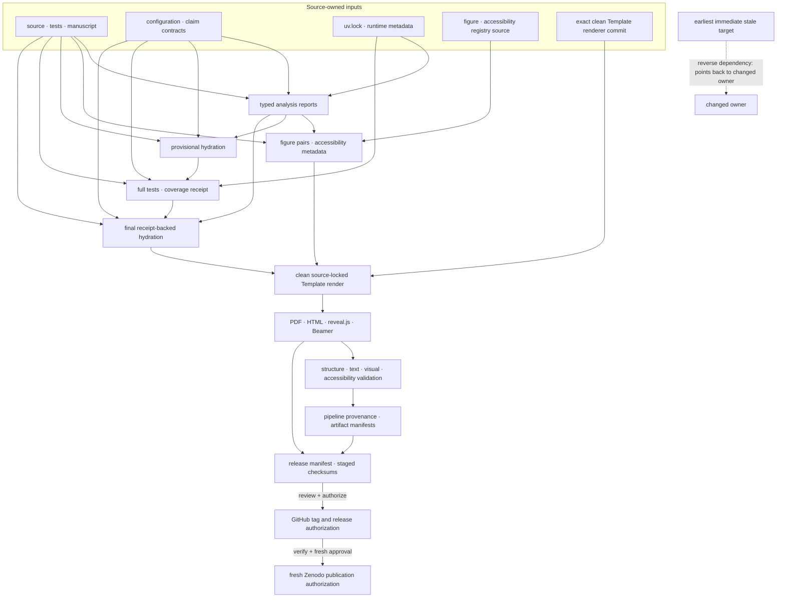

# Experiments and artifacts

The analysis pipeline is implemented in
[`src/analysis/workflow.py`](../../src/analysis/workflow.py). Pipeline stage 4
invokes it via [`scripts/02_run_analysis.py`](../../scripts/02_run_analysis.py).

## Source contract versus generated artifact status

The report and figure names below describe the checked-out producer contract;
an existing file with one of those names is not evidence that the current
contract has run. `scripts/validate_pipeline_freshness.py` is the authority for
the live source-versus-artifact state and names changed inputs when a stage is
stale. A source-current artifact requires fresh analysis, the test-and-coverage
receipt, final hydration, rendering, and freshness/surface validation in
dependency order. Do not copy a dated freshness diagnosis into this page.

For small, source-only API and transport executions that do not write the
reviewer snapshot, use [`examples/README.md`](../../examples/README.md). Those
programs demonstrate mechanics and recovery controls; they do not replace the
analysis-to-render producer chain described here.

The configured publication request is 480 primary seeds, 128
structural-extension seeds, 960 matched robustness-sweep trials, 64 seeds × 24
nested trials for conditional-world, gallery, and onset surfaces, 64 seeds ×
200 observations for the categorical BNN complement, and a 160-seed ×
24-trial review grid. These are source-configured budgets, not post-rerun
results. The review grid's 0.01 maximum-MCSE target applies across every signed
method × rate × directional-mechanism cell and must fail closed if unmet.

## Core experiments (`fedference.experiments`)

| Function | Source relationship / estimand | Key outputs |
| --- | --- | --- |
| `run_belief_sharing` | Categorical source-mechanism analogue to the belief-sharing mechanism illustrated in Friston Fig. 5; estimand is colony mean free energy in nats | `mean_free_energy`, communication gap |
| `run_language_acquisition` | Single-seed categorical trajectory used in the source-mechanism analogue related to Friston Fig. 7; estimand is KL in nats by ordered count step | `kl_trajectory`, `final_kl`, monotonicity flag |
| `run_emergence` | BMR structure-selection diagnostic related to the mechanism in Friston Fig. 9; estimand is deterministic ΔF in nats | `delta_F_redundant`, `delta_F_supported`, `convergence` |
| `run_robustness_sweep` | Declared paired contamination comparison of the project log-linear pool and legacy-named `robust_aggregate` server presets; the labels are not executed client losses, and any direction or verdict belongs to the fresh report | `accuracy_by_method_and_rate`, paired-test table, BH-FDR verdict |
| `run_review_grid` | Bounded conditional review surface: every predeclared non-KLD method is retained by directional mechanism and rate; no winner is selected for inference | Schema-`1.1` report, all signed seed-level contrasts, method-specific bootstrap intervals, configuration-bound BH/power levels, and MCSE precision receipt |
| `run_moving_world` | Study 5 three-condition finite simulation; the current source defines the contrast, while numerical direction and significance require a fresh report | `accuracy` (3 conditions), `free_energy_gap`, `n_steps_to_consensus` |
| `run_disjoint_fov_world` / `run_efe_navigation_test` | V4 finite disjoint-view communication and EFE-navigation controls; numerical direction and significance require a fresh report | `communicating_accuracy`, `isolated_accuracy`, `efe_navigation`, `gap`, `fov_width` (wrapped by `disjoint_fov_report`) |
| `run_hierarchical_world` | V2 Study 6 two-level federation (L2 context → L1 location); it reports location and context outcomes without a location-improvement presumption | `location_accuracy` (flat vs hierarchical), `context_accuracy`, `location_accuracy_gap` |
| `run_nlevel_world` | V2 Study 7 (generic depth) — N-level federation; called with depth=3 for Study 7; `run_3level_world` is a thin wrapper | `location_accuracy`, `context_accuracy`, `meta_context_accuracy`, `n_levels` |
| `run_belief_sharing_sensitivity` | Study 8a — 2-D sweep of belief-sharing accuracy gap over acuity × colony size | `communicating_grid`, `isolated_grid`, `accuracy_gap_grid` (shape: n_acuity × n_agents), `n_trials`, `seed` |
| `run_hierarchical_sensitivity` | Study 8b — 2-D sweep of hierarchical POMDP accuracy gap over acuity × colony size | `flat_grid`, `hierarchical_grid`, `accuracy_gap_grid` (shape: n_acuity × n_agents), `n_trials`, `seed` |
| `run_parameter_recovery` | Study 9 — ML grid-search over a deterministic declared likelihood grid from synthetic observations; validates finite-design acuity recovery | `true_acuity`, `recovered_acuity`, `recovered_acuity_ci_lo/hi`, `interval_method`, `interval_percent`, `abs_error`, `mean_abs_error`, `r_squared`, `n_trials`, `n_observations`, `acuity_grid`, `seed` |

`run_3level_world` is a convenience wrapper that calls `run_nlevel_world` with the
canonical 3-level stack. Both are exposed in `fedference.experiments`.

The robustness verdict is **computed** by `statistics.paired_test` +
`statistics.bh_fdr`, never hardcoded (ISC-30). Multi-seed reports now also
carry seed-level MCSE and approximate MDE fields; the seed is the inferential
unit, while clients and trials nested within it are descriptive inputs only.
Interpret the robustness statistics as paired, simulation-conditional evidence:
Wilcoxon tests operate on matched trial differences; BH-FDR is scoped to each
declared comparison family; percentile-bootstrap CIs resample the stated unit;
and `headline_power` / `n_for_target_power` are observed-effect design-planning
quantities, not independent proof of the verdict.

Figure captions follow the same boundary: deterministic panels say when they
have no error band, truncated axes are disclosed in captions and in-figure notes,
and the three robustness axes are labelled separately (`robust_aggregate`
heuristic, per-client FedGVI, and conservative `variational_aggregate`).

Experiment parameters (seeds, grid sizes, legacy server-preset labels, $\alpha$) live in
[`manuscript/config.yaml`](../../manuscript/config.yaml) under `experiment:` and
are loaded by `experiment_config.load_experiment_config()`.

The same block may declare `analysis_profile: publication|smoke` for the
workflow. `publication` is the default shipped profile and retains the stated
sample-size budgets. `smoke` is an explicit lower-budget, real execution path
for repeated temporary-project tests; it writes an execution sidecar but cannot
mint the analysis receipt required by non-draft hydration, rendering, or a
reviewer bundle. Its review-grid report is labelled `diagnostic_review_grid` and
records `target_status: not_evaluated` / `target_met: null`; only the publication
profile records a measured target as `met`. The optional
`experiment.bnn_torch` block similarly exposes the Torch complement's training
knobs without silently changing the categorical configuration.

## Single-machine research pilots

The open research lanes now have bounded, receipt-producing smoke/pilot
implementations. They are executable preparation, not confirmatory evidence:

| Runner | Primary estimand / unit | Required controls and boundary |
| --- | --- | --- |
| `robustness-calibration` | Mean held-out log score over independent calibration worlds; world is the unit | Complete candidate table, frozen configuration fingerprint, evaluation disjointness, and overlap rejection; no objective or universal-robustness claim |
| `fedgvi-bnn` | Paired held-out log-score difference between cavity-conditioned FedGVI and matched PVI/NLL; independently seeded end-to-end synthetic BNN run | CPU/MPS receipt, explicit fallback, checkpoint/resume equivalence, contamination baseline, and source-scale FashionMNIST/CUDA boundary |
| `hybrid-tracking` | Held-out next-position posterior-predictive log score per seeded tracking world | Naive, robust, discrete-only, continuous-only, and oracle-context controls plus singular-covariance rejection; no general continuous-control claim |
| `hierarchy-tasks` | Episode success within a matched horizon; task unit | Four Rooms and Key-Door with flat, oracle, learned, shuffled, and non-gating controls; no general hierarchy theorem |
| `friston-protocol` | Source-defined plotted quantity in native units; source-defined agent/episode/seed unit | Eq. 2/Figures 5, 7, and 9 parity matrix plus analogue-relabeling negative control; unresolved parameters remain paper-constrained |
| `external-tabular` | Contamination-conditioned held-out log-score difference; dataset unit with seeds nested | Pinned archive/member/split receipts, recovery and provenance controls, and dataset-level summaries; no deployment or universality claim |

All pilot reports pass the CLI evidence write-boundary contract before their
byte-bound receipt is emitted. A confirmatory run remains blocked until its
comparison family, budget, calibration policy, MCSE target, source/data
provenance, and manuscript artifact contract are frozen.

## Registered research and run receipts

`src/fedference/research_registry.py` is the machine-readable authority for
future evidence lanes. Each `ExperimentSpec` names its version, source bundle,
primary estimand, independent unit, falsifier, no-claim outcome, profiles,
smallest effect, MCSE target, maximum budget, comparison family, and runner.
Each `DatasetSpec` binds source URL/DOI/license, archive hash/member, schema,
preprocessing, and split policy. An `active` registry row means implementation
work is active; it is not a positive result.

The installed CLI writes experiment artifacts only into an explicit empty
directory outside committed `output/`. It then writes research `RunReceipt`
schema 1.2 binding the full commit, clean/dirty/unavailable tree state, lock
file, required runtime provenance,
configuration, dataset bytes, seeds, device/backend, fallbacks, checkpoints,
and completion status. Exact schema-1.1 receipts remain readable with missing
runtime provenance represented as unavailable. `config.json` and `report.json` are both byte-bound
outputs, and verification independently recomputes the canonical configuration
hash:

```bash
FEDFERENCE_EVIDENCE_ROOT="$(mktemp -d /tmp/active-fedference-evidence.XXXXXX)"
uv run --locked fedference list --json
uv run --locked fedference run server-theory \
  --profile smoke --seed 0 \
  --output-dir "$FEDFERENCE_EVIDENCE_ROOT/server-theory" \
  --project-root .
uv run --locked fedference verify \
  "$FEDFERENCE_EVIDENCE_ROOT/server-theory/receipt.json"
uv run --locked fedference verify \
  "$FEDFERENCE_EVIDENCE_ROOT/server-theory/receipt.json" \
  --require-clean-git --project-root .
```

The first verifier accepts an explicitly recorded dirty development tree while
checking its exact artifacts. The strict form is the publication gate: it
matches the receipt to the live full commit, clean tree, and `uv.lock` digest.
Use `--project-root /path/to/checkout` if the command is launched elsewhere.

External benchmark rows also retain each method's fallback-prediction count,
non-convergence count, and maximum solver iterations. A non-empty
`AggregationResult.fallback_events` value feeds these counts, and the receipt
summarizes affected dataset/seed/method cells. These are solver-health
diagnostics at held-out-prediction grain, not additions to the independent
dataset count.

The external-data runner additionally verifies the declared UCI archive before
parsing. Its smoke output is a mechanics check, not a publication report:

```bash
FEDFERENCE_BENCHMARK_ROOT="$(mktemp -d /tmp/active-fedference-benchmark.XXXXXX)"
uv run --locked fedference benchmark \
  --dataset-id uci-banknote --profile smoke --seed 42 \
  --cache-dir "$FEDFERENCE_BENCHMARK_ROOT/cache" \
  --output-dir "$FEDFERENCE_BENCHMARK_ROOT/run"
```

Smoke and pilot rows never enter confirmatory intervals or manuscript headline
values. A confirmatory pack must pass report-schema, negative-control,
provisional hydration/render as needed for the full suite, the source-bound
test-and-coverage receipt, final hydration, render, freshness, and release
verification in that order before it
can join the committed reviewer snapshot.

**Report-to-token dependency.** The hierarchical studies execute once in
`workflow.run_analysis_pipeline()`, which writes `hierarchical_world.json` and
`nlevel3_world.json`. The manuscript-variable loaders then read those reports
with strict key access. Token hydration therefore requires a current analysis
run and cannot silently recompute a second, potentially divergent result.

## JSON reports (`output/reports/`)

Expected from `run_analysis_pipeline()` on a completed fresh run:

| File | Producer | Consumed by |
| --- | --- | --- |
| `belief_sharing.json` | `_belief_sharing_report` | `generate_free_energy_comparison`, `generate_belief_heatmap`; tokens `BELIEF_SHARING_*` |
| `language_acquisition.json` | `_language_report` | `generate_language_kl_decay`; tokens `LANGUAGE_*` |
| `emergence.json` | `_emergence_report` | `generate_emergence_bmr`; tokens `EMERGENCE_*` |
| `robustness_sweep.json` | `_robustness_report` | `generate_robustness_sweep`; tokens `SWEEP_*` |
| `efe_decomposition.json` | `_efe_terms` | `generate_efe_decomposition` |
| `robust_influence_weights.json` | `_influence_weights` | `generate_robust_influence_weights` (server-side heuristic) |
| `bnn_robustness.json` | `_bnn_report` | `generate_bnn_robustness`; exploratory generalized-Bayes point-estimate logistic-regression baseline under synthetic label contamination; joint NLL/L2 and RCCE/L2 configurations differ in both loss and shrinkage, while legacy `KLD`/`AR` arguments select L2 coefficients rather than evaluated weight-space divergences |
| `variational_aggregation.json` | `_variational_aggregation_report` | `generate_aggregation_descent`, `generate_bounded_influence`; tokens `VARIATIONAL_*` (objective descent and tested weight response) |
| `contamination_gallery.json` | `_contamination_gallery_report` | `generate_contamination_gallery`; tokens `GALLERY_*`; pooled-best descriptive mechanism display, not selection-free inference |
| `robustness_onset.json` | `_robustness_onset_report` | `generate_robustness_onset`; tokens `ONSET_*`; pooled-best descriptive onset display, not selection-free inference |
| `moving_world.json` | `_moving_world_report` | `generate_moving_world`; tokens `MOVING_*` (accuracy / free-energy gap / steps-to-consensus for 3 conditions, V4) |
| `parameter_recovery.json` | `_parameter_recovery_report` | `generate_parameter_recovery`; tokens `PARAM_RECOVERY_*` |
| `bnn_torch.json` | `_bnn_torch_report` | Executed PyTorch point-mass deterministic MLP complement; tokens `BNN_TORCH_*`, `PYTORCH_VERSION` (`status: skipped` if torch absent) |
| `hierarchical_world.json` | `hierarchical_world_report` | Study 6 (2-level) standalone report; complements the `{{HIER_*}}` tokens |
| `nlevel3_world.json` | `nlevel3_world_report` | Study 7 (3-level) standalone report; complements the `{{NLEVEL3_*}}` tokens |
| `cross_study_summary.json` | `summarize_cross_study` | `generate_cross_study_summary`; native-unit signed contrasts from the separate harmonized seed-level rerun, with 95% percentile-bootstrap intervals over the 128 configured seeds |
| `disjoint_fov_world.json` | `disjoint_fov_report` | Powered disjoint-FOV necessity test (C1); chance baseline + paired stats |
| `heuristic_characterization.json` | `heuristic_characterization_report` | Numerical influence, finite-breakdown witness, declared attack grid, typed scoped-no-go witness metadata, and no-claim boundary for the sharp server heuristic |
| `hierarchical_bmr.json` | `hierarchical_bmr_report` | Hierarchical BMR structure-learning report and `generate_hierarchical_bmr` |
| `complexity_scaling.json` | `run_complexity_scaling` | Implementation-derived time/memory orders plus seeded repeated timing measurements; tokens `COMPLEXITY_*` |
| `conditional_world.json` | `run_conditional_world_generalization` | Finite hidden-state/target/observability/attack/weight grid with seed-level matched true-state-mass contrasts; MED-1 slice |
| `robustness_review_grid.json` | `_review_grid_report` / `run_review_grid` | `generate_robustness_review_grid`; tokens `REVIEW_GRID_*`; schema `1.1` all-method selection-free directional contrasts and a fail-closed precision receipt |
| `belief_quality.json` | `run_belief_quality_sensitivity` | Primary categorical log-score contrasts plus Brier/ECE diagnostics and oracle/uniform/confident-wrong controls; MED-2 slice |
| `application_integrity_flow.json` | `application_integrity_flow_contract` | `generate_application_integrity_flow`; deterministic labeled-request, solver-health, artifact, and verification contract |
| `evidence_replication_map.json` | `evidence_replication_map_contract` | `generate_evidence_replication_map`; deterministic claim-class, estimand, replication-unit, nesting, and no-transfer contract |
| `source_render_provenance.json` | `source_render_provenance_contract` | `generate_source_render_provenance`; deterministic producer-order, invalidation, and publication-authorization contract |

Every payload above is checked against a typed schema
([`src/analysis/report_schemas.py`](../../src/analysis/report_schemas.py)) at the
`_write_json` boundary, so a report cannot be emitted with a missing or
wrong-typed top-level field, and each figure generator's consumed report fields
are validated by the matching `FIGURE_DEPENDENCY_CONTRACTS` entry before it draws.

Ancillary artifacts also written under `output/reports/` include
`artifact_manifest.json`, `evidence_registry.json`, `invariants.json`,
`output_statistics.json`, `validation_report.json`, `rendered_provenance.json`,
`output_statistics.txt`, and `validation_report.md`, plus a `snapshots/`
subdirectory of per-pipeline-stage JSON snapshots. The artifact, evidence,
statistics, validation, rendered-provenance, and snapshot files are downstream
control-plane metadata rather than study payload. `invariants.json` remains a
normal producer result.

`output/figures/figure_exact_values.json` and its deterministic Markdown
companion are source-generated accessibility fallbacks, not manually copied
tables. They retain the exact plotted values for the registered complexity,
generalized-Bayes logistic-regression baseline, belief-quality, conditional-world,
robustness-review, sensitivity, and cross-study figures. Their `fig-values:*` identifiers,
source-report bindings, columns, and row inventories are validated together
with figure-registry schema 1.2.

Treat a fresh `output/reports/artifact_manifest.json` as the generated
inventory of the stable output tree, including `output/release/`. The schema-4
release manifest deliberately stops at the upstream
`publication-payload-v1` boundary and therefore excludes the downstream
control-plane files that bind or summarize it. Derive live counts from the
artifact manifest or from the filesystem verification command rather than
copying volatile counts into prose.

## Figures (`output/figures/`)

The rows below are producer expectations. Every listed PNG has a same-stem PDF
generated by the shared saver; the PNG is the manuscript/browser image and the
PDF is the vector archival companion. Existing checked-in pairs remain
historical until their reports, final hydration, and render receipt are fresh.

| PNG/PDF | Generator module | Manuscript label (see SYNTAX.md) |
| --- | --- | --- |
| `system_overview.png` / `system_overview.pdf` | `figures/system_overview.py` | Introductory system overview (`[@fig:system-overview]`) |
| `graphical_abstract.png` / `graphical_abstract.pdf` | `figures/graphical_abstract.py` | Graphical abstract (`[@fig:graphical-abstract]`) |
| `generative_model_schema.png` / `.pdf` | `figures/generative_model_schema.py` | Formal temporal, hierarchical, and factorial generative-model schema (`[@fig:generative-model-schema]`) |
| `message_passing.png` / `.pdf` | `figures/message_passing.py` | Belief-sharing message path and three robustness-axis ownership map (`[@fig:message-passing]`) |
| `pomdp_loop.png` / `.pdf` | `figures/pomdp_loop.py` | Hidden-state, observation, action, and federated-belief loop (`[@fig:pomdp-loop]`) |
| `free_energy_comparison.png` | `figures/free_energy_comparison.py` | belief-sharing free-energy contrast |
| `belief_heatmap.png` | `figures/belief_heatmap.py` | colony posterior heatmap |
| `language_kl_decay.png` | `figures/language_kl_decay.py` | language KL learning curve |
| `emergence_bmr.png` | `figures/emergence_bmr.py` | BMR $\Delta F$ contrast |
| `robustness_sweep.png` | `figures/robustness_sweep.py` | contamination sweep |
| `robust_influence_weights.png` | `figures/robust_influence_weights.py` | server-side pooling weights |
| `bnn_robustness.png` | `figures/bnn_robustness.py` | Exploratory generalized-Bayes point-estimate logistic-regression baseline comparing joint NLL/L2 and RCCE/L2 configurations under synthetic label contamination, with seed-level intervals and no RCCE-only or posterior-uncertainty claim |
| `efe_decomposition.png` | `figures/efe_decomposition.py` | EFE risk/ambiguity decomposition |
| `aggregation_descent.png` | `figures/aggregation_descent.py` | variational free-energy descent (`@fig:aggregation-descent`) |
| `bounded_influence.png` | `figures/bounded_influence.py` | server-side redescending normalized-weight diagnostic (`@fig:bounded-influence`) |
| `contamination_gallery.png` | `figures/contamination_gallery.py` | pooled-best descriptive robust-vs-naive mechanism gallery with seed-bootstrap bars and paired-difference table (`@fig:contamination-gallery`); not selection-free inference |
| `descent_comparison.png` | `figures/descent_comparison.py` | single-start capture vs multi-start escape (`@fig:descent-comparison`) |
| `robustness_onset.png` | `figures/robustness_onset.py` | pooled-best descriptive per-mechanism onset vs rate with seed-bootstrap bands (`@fig:robustness-onset`); not selection-free inference |
| `robustness_review_grid.png` | `figures/robustness_review_grid.py` | selection-free all-method robust-minus-KLD rate curves with method-specific 95% seed-bootstrap intervals, plus finite conditional-cell display (`[@fig:robustness-review-grid]`) |
| `evidence_replication_map.png` / `.pdf` | `figures/evidence_replication_map.py` | evidence-class, estimand, independent-unit, nesting, and no-transfer map (`[@fig:evidence-replication-map]`) |
| `disjoint_fov_world.png` | `figures/disjoint_fov_world.py` | Disjoint field-of-view geometry supporting the moving-world study |
| `moving_world.png` / `moving_world.pdf` | `figures/moving_world.py` | 3-condition comparison: isolated / communicating / EFE-guided; PNG is the manuscript embed and PDF is the archival companion (`[@fig:moving-world]`, V4) |
| `hierarchical_pomdp.png` | `figures/hierarchical_pomdp.py` | 2×3 six-panel: top row = 2-level belief dynamics (Study 6); bottom row = 3-level belief dynamics (Study 7) (`[@fig:hierarchical-pomdp]`, V2) |
| `hierarchical_bmr.png` | `figures/hierarchical_bmr.py` | Hierarchical BMR surprise under degenerate versus informative 3-level worlds |
| `heuristic_breakdown.png` | `figures/heuristic_breakdown.py` | Numerical influence, finite-breakdown comparison, and finite-search attack-grid coverage for the sharp server heuristic |
| `sensitivity_heatmap.png` | `figures/sensitivity_heatmap.py` | 2-panel heatmap of communicating-minus-isolated and hierarchical-minus-flat accuracy contrasts over acuity × colony size (Study 8, `[@fig:sensitivity-heatmap]`) |
| `cross_study_summary.png` | `figures/cross_study_summary.py` | Page-compatible two-column native-unit signed-contrast summary from the separate harmonized seed-level rerun, with 95% percentile-bootstrap intervals (`[@fig:cross-study-summary]`) |
| `parameter_recovery.png` | `figures/parameter_recovery.py` | 2-panel scatter+bar of parameter recovery accuracy (Study 9, `[@fig:parameter-recovery]`) |
| `complexity_scaling.png` | `figures/complexity_scaling.py` | Analytic-order guides and min--max repeated machine-scaling diagnostics (`[@fig:complexity-scaling]`) |
| `application_integrity_flow.png` / `.pdf` | `figures/application_integrity_flow.py` | labeled application validation, solver-health, artifact, and receipt-verification flow (`[@fig:application-integrity-flow]`) |
| `source_render_provenance.png` / `.pdf` | `figures/source_render_provenance.py` | source-to-render producer order, invalidation, and authorization gates (`[@fig:source-render-provenance]`) |

## Manuscript variable hydration

After reports exist, a provisional hydrate (and, only if required by the full
suite, provisional render) can supply renderer input. It is not release-facing.
Record the full-suite receipt, then perform final hydration without the
provisional flag:

```bash
uv run --locked python scripts/z_generate_manuscript_variables.py --provisional-validation
uv run --locked --extra dev python scripts/validate_test_coverage.py
uv run --locked python scripts/z_generate_manuscript_variables.py
```

This writes `output/data/manuscript_variables.json` and resolved copies under
`output/manuscript/`. Final provenance tokens are read from
`output/data/test_coverage_receipt.json`, which binds the successful test gate
to the source/test/documentation/manuscript/release-metadata/ISC/lock tree and
fresh analysis digests. Matching pre- and post-suite snapshots reject concurrent
drift rather than post-hoc attesting it. Token source:
[`src/manuscript_variables.py`](../../src/manuscript_variables.py).

For a publication run, `output/data/analysis_execution.json` additionally
records the configured/effective publication profile and a pre-run hash snapshot
of the declared analysis inputs. A non-canonical explicit configuration or an
input change during the run prevents the analysis receipt from being recorded.
The provisional hydrate is intentionally excluded from that receipt chain.

The hierarchical tokens consume the reports from the preceding analysis step;
missing reports fail token generation unless draft-mode degradation is
explicitly enabled.

The complexity report has two deliberately separate evidence layers. Its
`analytic_specs` rows are derived from the dense matrix operations and retained
histories in `src/fedference`; its `measurements` rows are wall-clock timings
from seeded inputs on the current machine. Timing slopes are descriptive and
must not be promoted to cross-machine performance guarantees, FLOP counts, or
distributed-network latency claims.

The conditional-world report likewise separates its finite grid from any
population or theorem claim. Its independent unit is the seeded scenario row;
agent- and trial-level values are nested. The belief-quality report treats the
categorical log score as primary and Brier/ECE as secondary diagnostics, with
the control ordering required to pass before any method contrast is discussed.

Detect unresolved tokens:

This check covers the hydrated Markdown sections and configuration. The source
configuration is unchanged; token-bearing string values are resolved in its
generated YAML copy. Preamble and BibTeX files remain source-exact auxiliaries
and are validated by their renderer consumers.

```bash
if rg -n --glob '*.md' --glob '*.yaml' '\{\{[A-Z][A-Z0-9_]*\}\}' output/manuscript/; then
  echo UNRESOLVED
  exit 1
else
  echo OK
fi
```

## Source-to-render production and invalidation graph



**Text equivalent.**

| Changed owner or producer | Immediate downstream target(s) | Dependency role and invalidation meaning |
| --- | --- | --- |
| `source` | `reports`, `figures`, `provisional`, `coverage`, `final_hydration` | Source code, tests, and manuscript bytes branch into analysis, rendering data, both hydrations, and the full gate; changing them invalidates each named immediate target. |
| `config` | `reports`, `provisional`, `coverage`, `final_hydration` | Configuration and claim contracts bind analysis, token resolution, and tests. |
| `lockfile` | `reports`, `coverage` | The environment lock binds executed reports and the full test/coverage run. |
| `registry` | `figures` | Figure and accessibility semantics bind deterministic PNG/PDF pairs and reader metadata. |
| `reports` | `figures`, `provisional`, `final_hydration` | Typed values feed both figures and manuscript tokens; figures do not feed hydration. |
| `provisional` | `coverage` | The provisional reader surface is tested before a coverage receipt can authorize final hydration. |
| `coverage` | `final_hydration` | The source-bound full-suite receipt is an explicit final-hydration input. |
| `final_hydration`, `figures`, `template_renderer` | `render` | Rendering consumes the final hydrated manuscript, final figure pairs, and the exact clean Template commit as three distinct dependencies. |
| `render` | `surfaces` | The exact renderer emits PDF, HTML, reveal.js, and untagged Beamer derivatives. |
| `surfaces` | `surface_validation`, `release_manifest` | Reader bytes are validated and separately inventoried; changing them invalidates both immediate targets. |
| `surface_validation` | `provenance` | Structural, textual, visual, reflow, and accessibility checks feed the provenance receipt. |
| `provenance` | `release_manifest` | Receipts and fixed surface bytes are sealed together without a reverse manifest dependency. |
| `release_manifest` | `github` | A reviewed manifest can enter—but cannot itself grant—the GitHub authorization gate. |
| `github` | `zenodo` | A verified GitHub release precedes a separately approved irreversible Zenodo call. |

The dashed reverse-validity example is an invalidation reminder, not a producer
dependency: it traces downstream evidence back to the class of upstream byte
changes that makes that evidence stale. The diagram itself is generated
from this source-owned pipeline contract and never reads the final release
manifest, avoiding a circular dependency.

## Regeneration order

From this repository root:

```bash
uv run --locked python scripts/02_run_analysis.py
uv run --locked python scripts/z_generate_manuscript_variables.py --provisional-validation
uv run --locked --extra dev python scripts/validate_test_coverage.py
uv run --locked python scripts/z_generate_manuscript_variables.py
```

If the full suite requires provisional template surfaces, use the explicit
provisional step in [`../manuscript/rendering_pipeline.md`](../manuscript/rendering_pipeline.md)
before recording the test receipt. Then render the final hydrated source from
the sibling template repository:

```bash
TEMPLATE_REPO=/path/to/template
cd "$TEMPLATE_REPO"
uv run --locked python scripts/pipeline/stage_03_render.py \
  --project working/active_fedference --skip-manuscript-hydration
uv run --locked python scripts/pipeline/stage_04_validate.py --project working/active_fedference
uv run --locked python scripts/pipeline/stage_05_copy.py --project working/active_fedference
```

Prepare the self-contained web package from this repository root:

```bash
uv run --locked python scripts/prepare_web_package.py
uv run --locked python scripts/validate_web_package.py
```

The validator includes the source-owned accessibility contract for document
language/title, skip/main navigation, image alternatives, figure captions,
labelled full-size links, and unique identifiers. Passing it defines the
HTML surface as accessibility-enhanced, not WCAG-conformant. The combined
manuscript PDF has a separate source-controlled tagged-structure gate; PDF/UA
remains a separate conformance and manual-review lane. See
[`../manuscript/accessibility.md`](../manuscript/accessibility.md).

## See also

- Output directory layout: [`../operations/output-layout.md`](../operations/output-layout.md)
- Token protocol: [`../manuscript/tokens-and-labels.md`](../manuscript/tokens-and-labels.md)
- Figure/section registry: [`../../manuscript/SYNTAX.md`](../../manuscript/SYNTAX.md)
