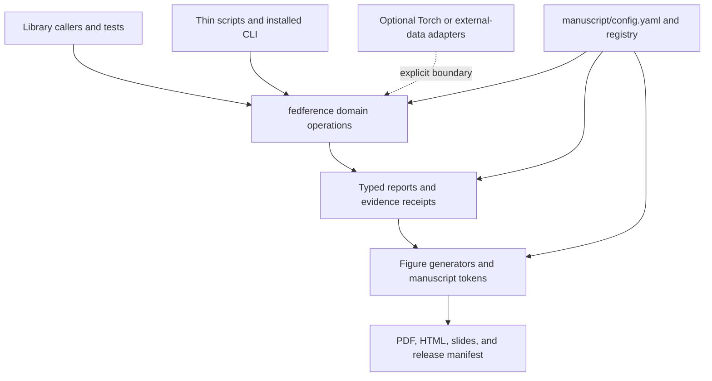

# Modularity and orchestration contract

Active Fedference is both a research library and a reproducible manuscript
pipeline. Modularity means that a domain operation can be imported and tested
without starting a process, that a report can be validated before a figure
consumes it, and that a publication artifact can be regenerated without
silently discovering a different checkout or stale input.

This page is the implementation map for contributors. The scientific claim
boundaries remain in the [claim audit](../research/manuscript-claim-audit.md),
and the release sequence remains in the
[rendering pipeline](../manuscript/rendering_pipeline.md) and
[Zenodo release guide](../reference/zenodo-release.md).

## Layer map



**Text equivalent.**

| Layer or input | Direct consumer | Boundary conveyed by the arrow |
| --- | --- | --- |
| Library callers and tests | `fedference` domain operations | Public callers use importable operations. |
| Thin scripts and installed CLI | `fedference` domain operations | Process adapters own arguments and status, not a second mathematical implementation. |
| Domain operations | Typed reports and evidence receipts | Results cross an explicit validated representation. |
| Reports and receipts | Figure generators and manuscript tokens | Reader-facing material consumes typed evidence. |
| Figures and tokens | PDF, HTML, slides, and release manifest | Publication surfaces are downstream products. |
| Configuration and registry | Domain, report, and figure layers | Source-owned controls constrain all three stages. |
| Optional Torch or external-data adapters | Domain operations | The dotted, labeled edge marks an explicit optional boundary; it is absent from the default import graph. |

The arrows describe ownership and data flow, not a promise that every module
imports every predecessor. In particular, `src/fedference/` must not import
`infrastructure.*`; publication and external-data effects stay at named
boundaries. The executable layer check and report write-boundary validator are
the authority when prose and an implementation diagram could be confused.

## Responsibilities by layer

| Layer | Owns | Does not own |
| --- | --- | --- |
| `src/fedference/` | Mathematical primitives, active-inference models, federation adapters, evidence schemas, registered study implementations, and explicit I/O boundaries | CLI grammar, manuscript prose, figure layout, or implicit network access |
| `src/analysis/` | Study orchestration, typed report schemas, canonical artifact declarations, and source-bound report writes | Domain equations copied from `fedference/` or arbitrary output discovery |
| `src/figures/` | Deterministic figure factories, metadata, visual estimands, and captions' machine-readable inputs | Inventing numbers, reading unvalidated report fields, or deciding claim strength |
| `src/manuscript_vars/` | Token loading, provenance, and deterministic hydration | Hand-authored numeric results or stale report fallback |
| `src/publication/` | Identifiers, freshness, HTML/PDF surface checks, release manifests, and Zenodo transport mechanics | Scientific promotion or silent DOI/version edits |
| `fedference_cli/` | Installed command grammar, registry dispatch, output isolation, and evidence receipts | Research algorithms and publication-snapshot writes |
| `scripts/` | Stable subprocess boundaries, root selection, sequencing, and status reporting | Numeric research logic or duplicated validation rules |
| `docs/`, `README.md`, `AGENTS.md` | Navigation, contracts, reader guidance, and claim boundaries | Source-of-truth results that are not generated or linked to receipts |

## The orchestration rule

Scripts and the installed CLI are useful because they make a workflow
repeatable from a shell, CI runner, clean clone, or sibling checkout. They are
not disposable wrappers: they own process arguments, exit status, path
selection, and sequencing. They are thin because reusable decisions belong in
typed Python modules where unit and integration tests can exercise them.

Use this split:

```text
command line / CI
    -> script or fedference_cli parser
        -> typed command handler or analysis workflow
            -> domain operation / report schema / publication boundary
                -> explicit artifact and provenance receipt
```

The same operation should not have a separate implementation for a notebook,
script, CLI command, and figure generator. Expose one typed operation and let
each caller adapt inputs and outputs at its own boundary.

### A good orchestrator

- resolves an explicit project root using the shared helper;
- validates caller-owned output paths before creating them;
- passes configuration and seeds into an importable operation;
- records stdout/status and names generated artifacts;
- refuses stale, malformed, or out-of-scope inputs;
- does not write the committed reviewer snapshot unless it is the declared
  producer for that stage; and
- leaves a receipt that another process can verify without trusting the caller's
  narrative.

### An overgrown orchestrator

An orchestrator needs refactoring when it contains domain equations, repeated
schema validation, implicit path discovery, hard-coded study parameters,
figure-specific parsing, or a second implementation of an operation already
available in `src/`. Move those decisions to the smallest typed module and
leave the boundary with argument handling, sequencing, and status mapping.

## Extension recipes

### Add a domain operation

1. Put the implementation in the appropriate `src/fedference/` module.
2. Keep the function deterministic under an explicit seed and return a typed or
   schema-valid result.
3. Preserve legacy public names when changing an established API; add a rich
   result/configuration path instead of changing an array-returning function's
   meaning.
4. Add edge cases, recovery limits, malformed-input tests, and a negative
   control. Add the corresponding ISC row without renumbering existing rows.

### Add a research lane

1. Declare the source bundle, estimand, unit, smallest effect, MCSE target,
   budget, comparison family, falsifier, profiles, and no-claim boundary in
   `fedference.research_registry`.
2. Keep smoke, pilot, and confirmatory states explicit. Confirmatory execution
   stays blocked until the registered pilot freezes its contract.
3. Implement the seeded operation in `fedference` or `analysis`; do not put
   study mathematics in a shell script.
4. Emit a typed report through the single write boundary and bind it to a
   configuration, Git revision/tree state, lockfile, dataset digest, and
   fallback/device disposition.
5. Add a CLI adapter only when a process boundary is useful. A registry entry
   alone is not evidence that the lane ran or succeeded.

### Add a report or figure

1. Extend `src/analysis/report_schemas.py` before writing a new payload.
2. Add the report dependency contract and update the canonical artifact list.
3. Add a figure generator under `src/figures/`, metadata in `_metadata.py`,
   and a test under `tests/figures/`.
4. Register source relation, estimand, unit, uncertainty, replication unit,
   `alt_text`, and no-claim language. Captions must describe what was measured,
   not merely what is visually present.
5. Regenerate figures and manuscript tokens from source; never patch a numeric
   value into `output/` or a hydrated manuscript by hand.

### Add a documentation page

1. Put the page in the narrowest `docs/` subfolder and add it to that folder's
   `README.md` and `AGENTS.md` inventory when it is a durable contract.
2. Link it from `docs/README.md` if it is a common routing destination.
3. Use repository-relative links, copy-pasteable commands, explicit no-claim
   boundaries, and source-owned terminology.
4. Add Mermaid only when a relationship is materially clearer as a diagram;
   provide `accTitle`, `accDescr`, quoted punctuation-bearing labels, visible
   labels on optional/future edges, and an immediately adjacent plain-language
   text equivalent, then run both static and renderer validation.
5. Check that every local link resolves and that the page does not introduce
   retired names, stale versions, or unsupported scientific generalizations.

### Add a runnable example

1. Put a small, deterministic program in `examples/` and use public APIs only;
   never reimplement aggregation or report logic in the example.
2. Emit machine-checkable, stable output. Exclude timestamps, ephemeral ports,
   absolute checkout paths, and other environment-specific values from the
   asserted surface.
3. Use caller-owned scratch paths for writes and reject non-empty destinations.
   A spawned-process example must be a real file with an
   `if __name__ == "__main__":` guard.
4. Execute the program as a real subprocess from outside the repository working
   directory in `tests/test_examples.py`, including a failure or negative
   control. Do not use mocks.
5. Route it through the source distribution, Ruff, runtime-surface scan,
   release provenance fingerprint, and validation-receipt inputs. Runnable
   examples are supported source, even though they do not belong in the wheel
   or reviewer-artifact payload.
6. Link it from `examples/README.md` and the nearest reader surface, and state
   exactly which scientific, transport, or publication claim it does not make.

## Receipts and write boundaries

There are three distinct boundaries:

- **Research run boundary:** `fedference_cli` writes `config.json`,
  `report.json`, and `receipt.json` into a new caller-owned directory outside
  `output/`. The report is validated before writing and the receipt binds the
  configuration, registry, seeds, lockfile, dataset, Git state, outputs, and
  fallback/device status.
- **Reviewer snapshot boundary:** `analysis.workflow`, manuscript hydration,
  the external template pipeline, web preparation, and release scripts write
  only their declared artifacts in producer order. Freshness receipts prevent a
  changed upstream report from masquerading as a current PDF.
- **Publication boundary:** `publication.zenodo`, GitHub release tooling, and
  an authorized operator transfer already-validated artifacts. A successful
  upload is not a scientific result, and a DOI must not be inserted into the
  manuscript until the reserved identifier and metadata are source-current.

Keep these boundaries separate. A local smoke receipt cannot authorize a
confirmatory claim; a rendered PDF cannot repair stale analysis; and a green
unit test does not prove clean-clone or external-publication state.

## Verification matrix

| Concern | Primary check |
| --- | --- |
| CLI package split and behavior | `tests/test_fedference_cli.py` plus Ruff/mypy |
| Script thinness and real process behavior | `tests/test_scripts_smoke.py` |
| Runnable public-interface ladder | `tests/test_examples.py` |
| Domain/import isolation | layer gate and `tests/test_runtime_surface.py` |
| Report and figure contracts | `tests/analysis/`, `tests/figures/`, `tests/test_caption_completeness.py` |
| Documentation links, stale language, and Mermaid | `tests/test_docs_contract.py` and `scripts/validate_mermaid.py` |
| Analysis → hydration → render order | `scripts/validate_pipeline_freshness.py` |
| Release publication-payload provenance | `scripts/build_release.py --verify` |
| Downstream artifact and validation controls | pinned Template stages 04-05 and artifact-manifest validation |
| Clean-clone portability | `scripts/validate_clean_checkout.py` and the isolated import probes |

The practical order is: run focused tests after a local change, run the full
source gate, regenerate producer-owned outputs, run rendered-surface and
freshness checks, build the upstream release payload, then refresh and verify
the downstream Template artifact/validation controls. Two release builds must
compare byte-identical before those controls are sealed; final verification is
read-only. Publication is the last boundary, after the immutable reviewed
commit and the final artifact hashes are known.

## Further reading

- [Architecture](../core/architecture.md)
- [Testing philosophy](testing_philosophy.md)
- [Style guide](style_guide.md)
- [API stability](../reference/api-stability.md)
- [Output layout](../operations/output-layout.md)
- [Security threat model](../security/active_fedference-threat-model.md)
