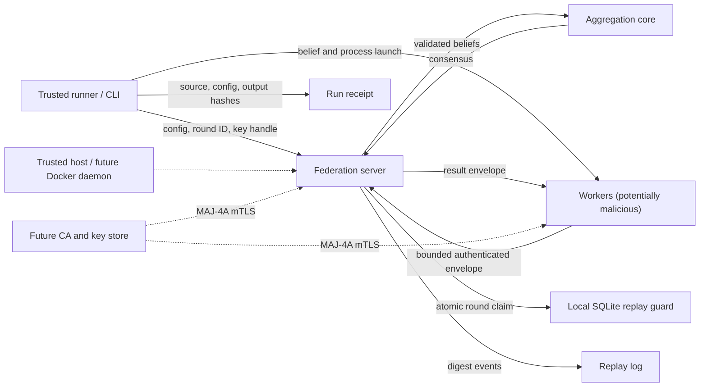

# Active Fedference threat model

Status: design-time model for the current loopback transport and the planned
MAJ-4A Docker/mTLS emulator. Last reviewed: 2026-07-29.

## Executive summary

Active Fedference currently runs a trusted local server and in-process,
single-machine process, or loopback TCP workers. The loopback adapter validates
versioned envelopes, payload digests, categorical belief schemas, worker sets,
bounded frame sizes, timeouts, and optional HMAC-SHA256 tags
(`src/fedference/federation/socket_transport.py`,
`src/fedference/federation/transport.py`). It also offers an optional
SQLite-backed round-ID guard that survives local process restarts.

The highest residual risks are a compromised worker sending statistically
harmful but schema-valid beliefs, shared-HMAC-key compromise allowing worker
impersonation, denial of a round through connection or message withholding, and
operator error that omits or mis-scopes durable replay state. The current
adapter is therefore restricted in code to IPv4 loopback. It does not provide
transport confidentiality, per-worker identity, Byzantine tolerance, privacy,
or a secure cross-host deployment.

MAJ-4A may widen the claim only to an mTLS-default local Docker emulator after
certificate identity, fault injection, restart, and reference-consensus gates
pass. Physical-host security remains MAJ-4B and requires separate receipts.

## Scope and assumptions

In scope:

- the versioned belief/result envelope and NumPy serialization in
  `src/fedference/federation/transport.py`;
- the loopback TCP server, workers, HMAC framing, replay logs, and
  `ReplayGuard` implementations in
  `src/fedference/federation/socket_transport.py`;
- aggregation dispatch in `src/fedference/federation/server.py` and
  `src/fedference/aggregation.py`;
- run receipts and artifact hashes in `src/fedference/evidence.py`;
- the planned MAJ-4A Docker/mTLS emulator described in
  `docs/todo/true-multi-machine-federation.md`.

Out of scope:

- internet-facing or multi-tenant service operation;
- protection of the host after a privileged local compromise;
- secure aggregation, differential privacy, trusted execution, or
  confidentiality of beliefs at rest;
- claims about physical multi-host deployment before MAJ-4B evidence exists;
- availability guarantees beyond bounded local test rounds.

Assumptions to validate before MAJ-4A implementation:

- the server and host operator are trusted;
- workers may fail, be buggy, or be malicious, but do not initially control the
  server host;
- research beliefs can be sensitive even when they contain no direct
  identifiers, so future cross-host transport requires encryption;
- private keys and the persistent replay database will be mounted with
  least-privilege permissions and will not be embedded in images or source;
- the default deployment remains local and non-regulated. A multi-tenant,
  internet-facing, or regulated setting requires a new review.

The local implementation is bound to [TLS 1.3](https://www.rfc-editor.org/rfc/rfc8446.html),
[X.509 path validation](https://www.rfc-editor.org/rfc/rfc5280.html),
[Python's `ssl` interface](https://docs.python.org/3/library/ssl.html), and
[Docker Compose networking](https://docs.docker.com/compose/how-tos/networking/)
as design authorities for MAJ-4A. Those sources constrain a future
implementation; their presence does not mean TLS or Docker federation exists
today.

## System model

### Primary components

| Component | Trust | Security-relevant responsibility | Repository evidence |
| --- | --- | --- | --- |
| Experiment runner / CLI | Trusted operator boundary | Selects configuration, output directory, keys, round IDs, and receipt policy | `src/fedference_cli/`, `src/fedference/evidence.py` |
| Federation server | Trusted in the current model | Admits exactly the declared workers, validates envelopes, aggregates beliefs, returns consensus | `FederationServer.run_round`; `run_socket_round` |
| Worker | Potentially faulty or malicious | Produces one belief and consumes one consensus for the declared round | `_worker`; `FederationWorker` |
| Aggregator | Trusted code, adversarial input | Validates beliefs/configuration and computes the selected pool | `aggregate_result`; `_validation.py` |
| Replay database | Trusted local integrity state | Atomically claims round IDs across local process restarts | `PersistentReplayGuard.claim` |
| Replay/evidence files | Operator-owned audit data | Record event digests, configuration, device, source, and output hashes | `save_socket_replay`; `RunReceipt` |
| Future certificate authority and mTLS endpoints | Not implemented | Bind service/worker identity and encrypt cross-container traffic | MAJ-4A only |
| Docker daemon and host | Privileged trusted computing base | Creates networks, mounts secrets/state, and isolates containers | MAJ-4A only |

### Data flows and trust boundaries

1. The trusted runner supplies beliefs, `AggregationConfig`, a round ID,
   optional HMAC key, optional replay path, and optional replay guard.
2. Each worker serializes one float64 probability vector, binds it to a protocol
   envelope, and sends a bounded length-prefixed frame.
3. The server validates frame authentication, envelope identity/configuration,
   payload digest, worker uniqueness, and probability schema before aggregation.
4. The server returns a result envelope to every declared worker and can write
   a digest-only replay log.
5. The evidence layer can bind configuration, Git state, datasets,
   checkpoints, device/fallback events, and output bytes into a run receipt.

The current network boundary never leaves loopback: `_validate_loopback_host`
rejects wildcard and non-loopback IPv4 resolutions, returns the checked numeric
address, and binds that value without a second hostname lookup.
The HMAC key, replay database, output directory, and any future private keys
cross from the operator boundary into the runtime and must never be accepted
from an untrusted experiment payload.

#### Diagram

## Assets and security objectives

| Asset | Objective |
| --- | --- |
| Beliefs and consensus | Integrity in every admitted round; confidentiality only after mTLS is implemented |
| Aggregation configuration | Bound cryptographically to every envelope and receipt |
| Worker and server identity | Exact numeric worker-set validation now; certificate-bound identities in MAJ-4A |
| Round uniqueness | Reject reused identifiers in the configured replay domain, including local restarts when `PersistentReplayGuard` is used |
| Availability | Bound frame sizes and wait time; fail the whole round on missing, duplicate, malformed, or out-of-order inputs |
| Replay and run evidence | Detect modification through schema validation and SHA-256; record provenance without leaking raw belief payloads by default |
| Release claims | Prevent a local transport fact from being promoted into privacy, Byzantine, cross-host, or deployment-security claims |

## Attacker model

### Capabilities

- control one or more workers and choose any schema-valid categorical belief;
- connect to the local listening port from another process on the same host;
- withhold, duplicate, delay, reorder, truncate, or corrupt frames;
- replay a previously observed envelope or round identifier;
- read or alter caller-owned state if filesystem permissions grant access;
- impersonate any HMAC participant after obtaining the shared key;
- exhaust the per-round connection/timeout budget within local host limits.

### Non-capabilities

- break SHA-256, HMAC-SHA256, or correctly configured TLS 1.3;
- bypass OS permissions without an independent host compromise;
- modify trusted source, configuration, or receipts without changing their
  recorded hashes;
- make a schema-invalid array execute code through NumPy loading, because all
  transport loads use `allow_pickle=False`;
- turn transport integrity into statistical robustness or privacy.

## Entry points and attack surfaces

- `run_socket_round`: host, beliefs, worker count, configuration, timeout,
  `auth_key`, `round_id`, replay path, and replay guard;
- length-prefixed socket frames and JSON envelope headers;
- `.npy`/`.npz` belief and result payloads;
- shared HMAC keys and future TLS private keys/certificates;
- SQLite replay-guard path and replay JSON path;
- explicit CLI output directories, checkpoint inputs, and receipt files;
- Docker daemon socket, container images, networks, mounts, health checks, and
  fault-control interfaces in the future emulator;
- dependency lock and release artifacts in CI/development, separate from the
  runtime worker/server trust boundary.

## Fault model for MAJ-4A

Every emulator fault is configuration-bound, seeded when timing is involved,
and recorded in the round receipt. The no-fault control must remain
bit-identical to the in-process reference.

| Fault | Injection point | Required disposition |
| --- | --- | --- |
| Drop / withheld message | Before a worker send or server broadcast | Whole round times out and fails; no partial consensus is published |
| Duplicate worker/frame | Admission queue or transport proxy | Duplicate numeric/certificate identity is rejected |
| Delay | Before connect, read, aggregation, or broadcast | Completes within the global deadline or fails with the declared timeout stage |
| Out of order | Worker arrival and result delivery | Arrival order cannot change sorted-worker consensus or replay validation |
| Replay | Prior frame/round after in-process and container restart | Reused round ID is rejected in the declared persistent replay domain |
| Tamper / truncate / oversize | Envelope header, payload, auth tag, length prefix | Validation fails before deserialization or aggregation |
| Wrong key, trust root, certificate, identity, or usage | Handshake/admission | Connection is rejected; HMAC mode cannot silently replace required mTLS |
| Worker/server crash | Before and after durable checkpoint boundaries | Restart resumes only from a complete compatible checkpoint or fails closed |
| Replay-state omission, divergence, corruption, or rollback | Container mount/startup | Confirmatory profile refuses to start or reports a failed recovery control |
| Docker network partition / DNS alias error | Container network | No fallback to host/wildcard/plaintext networking; round fails visibly |

The emulator must distinguish an injected expected failure from an
implementation crash. A negative control passes only when the observed error
class, stage, affected worker/round, and absence of a published consensus match
the preregistered disposition.

## Top abuse paths

1. **Schema-valid poisoning:** a compromised worker sends a valid probability
   vector chosen to shift consensus. Serialization and HMAC validation pass;
   only declared aggregation behavior limits the effect. This is not a
   Byzantine-robust protocol.
2. **Shared-key impersonation:** one HMAC key is copied from a worker. The
   attacker can authenticate frames as any numeric worker because the key is
   not identity-bound.
3. **Round denial:** an untrusted local process occupies an expected connection
   slot, sends a malformed frame, or withholds a complete frame. The server
   fails closed after the configured timeout, but the round is unavailable.
4. **Replay-domain gap:** a caller omits the guard, creates a new in-memory
   guard after restart, or points servers at different SQLite files. A reused
   round ID can then be accepted in a different protection domain.
5. **Future mTLS misconfiguration:** MAJ-4A encrypts sockets but fails to require
   client certificates, validate certificate paths/usage, rotate keys, or
   isolate the Docker daemon. Encryption alone would not establish worker
   identity or container-host safety.

## Threat model table

| ID | Threat and affected asset | Preconditions | Existing controls | Residual risk / required mitigation | Severity | Likelihood | Priority |
| --- | --- | --- | --- | --- | --- | --- | --- |
| TM-001 | A malicious worker poisons consensus with a schema-valid belief | Worker controls its input | Finite-simplex validation; exact worker set; declared robust/variational comparators | No Byzantine guarantee. Add explicit attack families and detection/falsifier evidence; never label HMAC as poisoning resistance | High | Medium | P0 scientific/security boundary |
| TM-002 | Shared HMAC key permits worker impersonation and provides no confidentiality | Key is copied or exposed | HMAC-SHA256 uses constant-time comparison; envelope binds worker, round, config, and digest | MAJ-4A must use TLS 1.3 with required client certificates, per-worker identity, scoped keys, rotation, and revocation | High | Medium | P0 before cross-container claims |
| TM-003 | Replay accepted after restart or across inconsistently scoped servers | Guard omitted, reset, deleted, or not shared | In-memory `ReplayGuard`; atomic SQLite `PersistentReplayGuard`; round/config binding | Make persistent guard mandatory in long-running profiles; define retention, backup, file permissions, and shared-state semantics | High | Medium | P0 runtime gate |
| TM-004 | Connection/frame withholding or slot capture denies a round | Attacker can reach local port | Numeric loopback-only bind without a second DNS lookup; bounded frame length; socket timeouts; whole-round fail-closed behavior | Add authenticated admission before expensive reads, global round deadline, connection budget, cancellation, and fault-injection tests | Medium | Medium | P1 |
| TM-005 | Oversized or malformed input consumes memory/CPU | Attacker can send a frame | 128 MiB frame cap; 64 KiB envelope-header cap; strict JSON field set; `allow_pickle=False`; probability validation | Lower profile-specific limits, stream/budget reads, and measure peak memory under adversarial concurrency | Medium | Low | P1 |
| TM-006 | Replay/evidence files or SQLite state are replaced, truncated, symlinked, or permission-exposed | Local filesystem access | Replay schema/digest validation; guard rejects a symlink at construction; run receipts hash outputs | Harden open/create semantics, permissions, retention, and crash recovery; receipts require an external trust anchor for tamper evidence | Medium | Low | P1 |
| TM-007 | Future certificate validation accepts the wrong peer or stale credential | mTLS adapter exists but trust policy is incomplete | Not implemented; RFC 8446/5280 and Python `ssl` are pinned design sources | Require client auth, hostname/service identity, EKU/path checks, expiry/revocation policy, rotation drill, and negative tests | High | Medium | P0 for MAJ-4A |
| TM-008 | Docker daemon or mounted secret compromise escapes the intended emulator boundary | Host/daemon is exposed or container runs overly privileged | Not implemented; Docker security/network sources are pinned | No daemon socket in workers, unprivileged/read-only containers, scoped secret mounts, image digests/SBOM, isolated networks, host firewall | Critical | Low | P0 for MAJ-4A |
| TM-009 | Runtime or release claims overstate integrity as privacy, secure aggregation, or physical multi-host evidence | Documentation/review failure | Claim ledger, ISA gates, experiment registry, run receipts, clean-checkout/release verification | Keep explicit no-claim outcomes and require source/config/receipt links for every promoted claim | High | Medium | P0 governance |
| TM-010 | Dependency or source-tree compromise changes the executed experiment | CI/developer or release environment compromised | Locked environment, Git commit/tree state, artifact hashes, release provenance fingerprint | Add signed release/attestation lane and isolate build credentials; local green checks are not release authority | High | Low | P1 supply chain |

## Criticality calibration

- **Critical:** host- or daemon-level compromise that can escape all experiment
  boundaries, steal every credential, or alter all evidence.
- **High:** consensus integrity, peer identity, replay safety, confidentiality,
  or scientific-claim integrity can be materially violated.
- **Medium:** one round can be denied or local audit evidence can be damaged
  without a full trust-boundary compromise.
- **Low:** bounded diagnostic leakage or nuisance with no material effect on
  consensus, evidence, or release claims.

Likelihood is estimated for the stated local research deployment, not an
internet-facing service. Any external exposure raises TM-002 through TM-008 and
requires a new assessment before execution.

## Focus paths for security review

1. `src/fedference/federation/socket_transport.py`: framing, HMAC use, loopback
   enforcement, timeout/cancellation, replay-state atomicity, and file handling.
2. `src/fedference/federation/transport.py`: strict envelope schema, size
   bounds, digest binding, NumPy deserialization, and probability validation.
3. `src/fedference/federation/server.py` and
   `src/fedference/aggregation.py`: exact worker admission, duplicate handling,
   custom aggregator dispatch, and schema-valid poisoning behavior.
4. Future MAJ-4A TLS adapter: required client authentication, certificate
   identity/path/usage validation, key lifecycle, and downgrade prevention.
5. Future Docker assets: daemon exposure, image provenance, privileges,
   networks, health checks, secret/replay mounts, restart semantics, and
   deterministic fault controls.
6. `src/fedference/evidence.py` and release validation: dirty-tree policy,
   source/config/output hashes, stale receipt invalidation, and external
   release/signing authority.

Review this model after any protocol version change, new authentication mode,
network exposure, persistence backend, worker-admission rule, secret-handling
path, or deployment claim.
